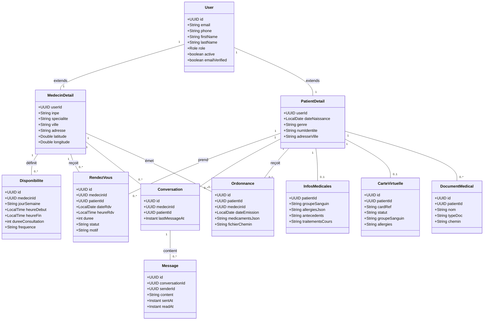

# Diagramme de classes — Doctorek

Diagramme simplifié (modèle de données principal). Format Mermaid — renderable dans GitHub, VS Code (extension Mermaid), ou via Eraser.io (coller le code Mermaid dans un nouveau diagramme).

## Notes pour le rapport
- `User` = table commune (auth, rôles : PATIENT, MEDECIN, ADMIN).
- `MedecinDetail` / `PatientDetail` = extension 1-1 de `User` (héritage par table jointe).
- Champs JSON (`medicamentsJson`, `allergiesJson`, `questionnaireJson`) simplifiés en attribut unique pour lisibilité — détailler en annexe si besoin.
