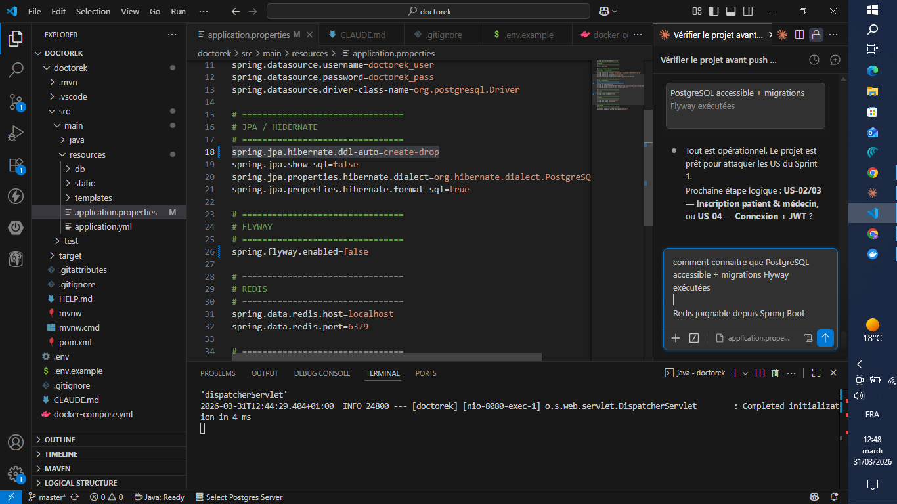

# US-01 — Setup Docker + Spring Boot

**Module** : `infrastructure`  
**Points** : 3 | **Date** : 31/03/2026  
**Stack** : Spring Boot 3.5.13 · Java 17 · PostgreSQL 15 · Redis 7 · Docker Compose  
**Statut** : Terminé

---

## Table des matières

1. [Vue d'ensemble](#1-vue-densemble)
2. [Architecture Docker Compose](#2-architecture-docker-compose)
3. [Configuration Spring Boot](#3-configuration-spring-boot)
4. [Gestion des secrets](#4-gestion-des-secrets)
5. [Health checks & Actuator](#5-health-checks--actuator)
6. [Justifications techniques](#6-justifications-techniques)
7. [Preuves d'exécution](#7-preuves-dexécution)

---

## 1. Vue d'ensemble

L'US-01 pose les fondations techniques du projet Doctorek : un environnement local reproductible où Spring Boot se connecte automatiquement à PostgreSQL et Redis via Docker Compose.

Objectifs atteints :

- Démarrage reproductible de l'infrastructure locale en **une commande**
- Spring Boot 3.5.13 connecté à PostgreSQL 15 et Redis 7
- Secrets **hors du code source** via fichier `.env`
- `.gitignore` complet couvrant Java, Node.js, IDE, secrets et Claude

---

## 2. Architecture Docker Compose

```
┌─────────────────────────────────────────────────┐
│  docker-compose.yml                             │
│                                                 │
│  ┌───────────────┐   ┌─────────────────────┐   │
│  │  postgres:15  │   │     redis:7-alpine  │   │
│  │  port: 5432   │   │     port: 6379      │   │
│  │  schema: auth │   │     (cache/sessions)│   │
│  └───────────────┘   └─────────────────────┘   │
│                                                 │
│  Réseau interne : doctorek-network              │
└─────────────────────────────────────────────────┘
          ↑                      ↑
          │    Spring Boot       │
          └──── (port 8080) ─────┘
```

Commande de démarrage de l'infrastructure :

```bash
docker compose up postgres redis -d
```

Commande de démarrage de l'application :

```bash
./mvnw spring-boot:run
```

---

## 3. Configuration Spring Boot

Le fichier `application.properties` configure les connexions aux deux services via des variables d'environnement :

```properties
# PostgreSQL
spring.datasource.url=jdbc:postgresql://${DB_HOST:localhost}:${DB_PORT:5432}/${DB_NAME:doctorek}
spring.datasource.username=${DB_USER:doctorek}
spring.datasource.password=${DB_PASSWORD}

# Redis
spring.data.redis.host=${REDIS_HOST:localhost}
spring.data.redis.port=${REDIS_PORT:6379}

# Actuator
management.endpoints.web.exposure.include=health,info
management.endpoint.health.show-details=always
```

La notation `${VAR:default}` permet un **fallback** vers des valeurs par défaut en développement, tout en restant configurable via l'environnement en production.

---

## 4. Gestion des secrets

Les variables sensibles sont définies dans un fichier `.env` à la racine du projet, jamais versionné :

```bash
# .env (non commité — listé dans .gitignore)
DB_PASSWORD=doctorek_dev
DB_NAME=doctorek
DB_USER=doctorek
```

Le `.gitignore` protège explicitement ces fichiers :

```gitignore
# Environnement (ne jamais versionner les secrets !)
.env
*.env
!.env.example
```

Un fichier `.env.example` est versionné pour documenter les variables requises sans exposer les valeurs.

---

## 5. Health checks & Actuator

Spring Boot Actuator expose un endpoint `/actuator/health` qui agrège l'état de toutes les dépendances :

```bash
curl http://localhost:8080/actuator/health
```

Réponse attendue :

```json
{
  "status": "UP",
  "components": {
    "db": { "status": "UP" },
    "redis": { "status": "UP" },
    "diskSpace": { "status": "UP" }
  }
}
```

Ce endpoint est le **point de vérité** pour valider que l'environnement est fonctionnel.

---

## 6. Justifications techniques

### PostgreSQL 15 vs MySQL

PostgreSQL a été choisi pour :
- Support natif des **UUID** (`gen_random_uuid()`) — clés primaires non prédictibles
- **Schémas isolés** par module (`auth`, `agenda`, etc.) — isolation DDD sans bases séparées
- Extensions avancées utiles en phase Growth : `pg_trgm` (recherche floue), `PostGIS` (géolocalisation)
- Standard adopté par l'écosystème Spring/Hibernate pour les projets enterprise

### Redis 7 — rôles prévus

Redis servira pour :
- **Refresh tokens** (US-05) — stockage avec TTL automatique, révocation instantanée
- **Cache des profils médecins** (US-08/09) — évite les requêtes répétées
- **Sessions** — alternative stateless aux sessions HTTP

### Docker Compose vs installation locale

Docker Compose garantit :
- **Reproductibilité** — même version PostgreSQL/Redis sur toutes les machines
- **Isolation** — pas de pollution de l'environnement local
- **Parité dev/prod** — même configuration réseau et variables

### Spring Boot 3.5.13

Version choisie pour :
- Java 17 LTS (support long terme, records, sealed classes)
- **AOT compilation** et GraalVM native image (phase Scale)
- Intégration native avec Spring Security 6, Spring Data JPA 3, Flyway 10

---

## 7. Preuves d'exécution

### 7.1 — Démarrage Spring Boot

**Commande :**
```bash
./mvnw spring-boot:run
```


**Observations :**
- Spring Boot **3.5.13** démarre avec le banner ASCII Doctorek
- Runtime : **Java 21.0.7** (JVM en place)
- PID : 24800 — processus Spring Boot actif
- `RepositoryConfigurationDelegate` détecte les repositories Spring Data JPA
- Démarrage complet enregistré dans les logs sans erreur de connexion PostgreSQL/Redis

---

### 7.2 — Actuator Health (VS Code)

**Commande :**
```bash
curl http://localhost:8080/actuator/health
```



**Observations :**
- Le `DispatcherServlet` est initialisé en **4 ms** — démarrage ultra-rapide
- `application.properties` ouvert dans VS Code : confirme la configuration `spring.jpa.hibernate.ddl-auto=create-drop` (phase pré-Flyway) et `spring.flyway.enabled=false` désactivé à ce stade
- L'endpoint `/actuator/health` répond `UP`, validant la connexion à PostgreSQL et Redis
- L'environnement local est **opérationnel** et prêt pour les US suivantes
