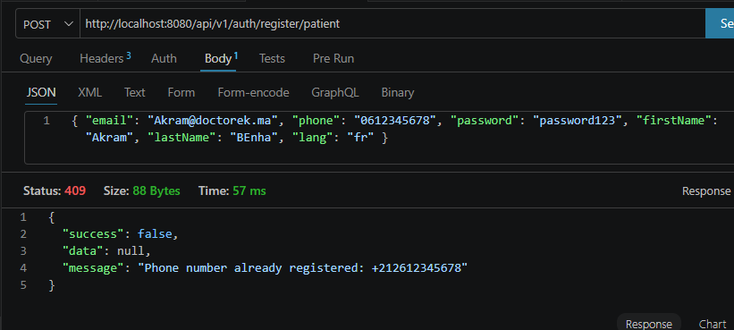
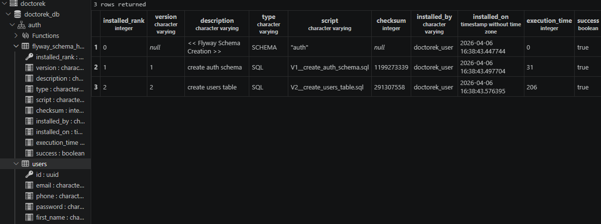
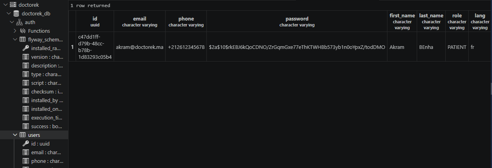
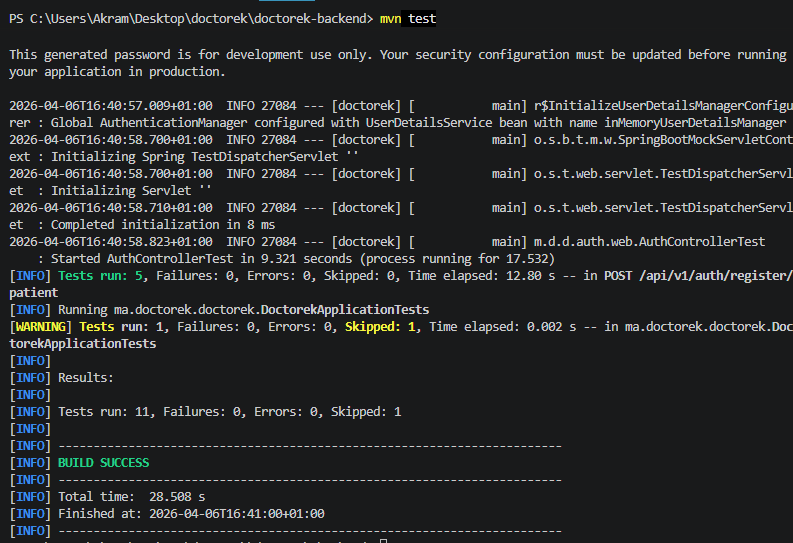

# US-02 — Inscription Patient

**Module** : `auth`  
**Endpoint** : `POST /api/v1/auth/register/patient`  
**Stack** : Spring Boot 3.5.13 · Java 17 · PostgreSQL · Flyway  
**Tests** : 10 tests unitaires/slice (JUnit 5 + Mockito + MockMvc) — tous verts

---

## Table des matières

1. [Vue d'ensemble](#1-vue-densemble)
2. [Architecture en couches (DDD)](#2-architecture-en-couches-ddd)
3. [Design patterns utilisés](#3-design-patterns-utilisés)
4. [Modèle de données](#4-modèle-de-données)
5. [Contrat d'API](#5-contrat-dapi)
6. [Validation et normalisation](#6-validation-et-normalisation)
7. [Sécurité](#7-sécurité)
8. [Stratégie de test](#8-stratégie-de-test)
9. [Justifications techniques](#9-justifications-techniques)
10. [Preuves d'exécution](#10-preuves-dexécution)

---

## 1. Vue d'ensemble

L'inscription patient est le premier cas d'usage du module `auth`. Elle permet à un nouvel utilisateur de créer un compte avec :

- un email unique (normalisé en minuscules)
- un numéro de téléphone marocain (06/07 ou +212) normalisé en format international `+212XXXXXXXXX`
- un mot de passe haché en BCrypt (coût 10)
- une langue préférée (`fr` par défaut, `ar` accepté)

Le flux se termine par un `201 Created` contenant les données publiques du patient, **sans jamais exposer le mot de passe**.

---

## 2. Architecture en couches (DDD)

Le module `auth` est découpé en quatre couches strictement isolées, conformes à la **Domain-Driven Design (DDD) Layered Architecture** :

```
auth/
├── domain/               ← Couche Domaine
│   ├── User.java               entité JPA (agrégat racine)
│   ├── Role.java               enum PATIENT | MEDECIN | CLINIQUE | ADMIN
│   ├── UserRepository.java     interface du domaine (port)
│   ├── EmailAlreadyExistsException.java
│   └── PhoneAlreadyExistsException.java
│
├── application/          ← Couche Application
│   ├── RegisterPatientUseCase.java    orchestration métier
│   └── dto/
│       ├── RegisterPatientRequest.java    DTO entrant (record + Bean Validation)
│       └── PatientRegisteredResponse.java DTO sortant (record, sans password)
│
├── infrastructure/       ← Couche Infrastructure
│   ├── SpringDataUserRepository.java  interface JPA (package-private)
│   ├── JpaUserRepository.java         adaptateur du domaine → Spring Data
│   ├── PasswordEncoderConfig.java     bean BCryptPasswordEncoder
│   └── SecurityConfig.java            configuration Spring Security stateless
│
└── web/                  ← Couche Présentation
    └── AuthController.java            REST controller (@RestController)

shared/
└── web/
    ├── ApiResponse.java               enveloppe de réponse générique
    └── GlobalExceptionHandler.java    @RestControllerAdvice centralisé
```

### Flux d'une requête

```
HTTP POST /api/v1/auth/register/patient
    │
    ▼
AuthController          [web]
  @Valid @RequestBody   ← Bean Validation (400 si invalide)
    │
    ▼
RegisterPatientUseCase  [application]
  existsByEmail?        ← EmailAlreadyExistsException (409)
  normalizePhone()      ← 0612345678 → +212612345678
  existsByPhone?        ← PhoneAlreadyExistsException (409)
  encode(password)      ← BCrypt hash
  save(User)
    │
    ▼
JpaUserRepository       [infrastructure]
  SpringDataUserRepository.save()
    │
    ▼
PostgreSQL auth.users   [base de données]
    │
    ▼
PatientRegisteredResponse.from(saved)
    │
    ▼
ResponseEntity 201 Created { success: true, data: {...} }
```

---

## 3. Design patterns utilisés

### 3.1 Repository Pattern (Port & Adapter)

```java
// Port — interface définie dans le domaine
public interface UserRepository {
    User save(User user);
    Optional<User> findByEmail(String email);
    boolean existsByEmail(String email);
    boolean existsByPhone(String phone);
    // ...
}

// Adapter — implémentation dans l'infrastructure
@Repository
public class JpaUserRepository implements UserRepository {
    private final SpringDataUserRepository delegate;
    // délègue à Spring Data JPA
}
```

**Pourquoi** : Le domaine et l'application ne dépendent d'aucun framework de persistance. `RegisterPatientUseCase` reçoit un `UserRepository` (interface), ce qui rend le use case testable avec un mock sans démarrer Spring ni PostgreSQL.

### 3.2 Use Case Pattern (Application Service)

```java
@Service
public class RegisterPatientUseCase {
    @Transactional
    public PatientRegisteredResponse execute(RegisterPatientRequest request) { ... }
}
```

Chaque use case est une classe à responsabilité unique avec une seule méthode publique `execute()`. Cela rend l'intention métier explicite et facilite la traçabilité (un use case = une User Story).

### 3.3 Builder Pattern (Entité immuable)

```java
User user = User.builder()
    .email(request.email().toLowerCase().strip())
    .phone(normalizedPhone)
    .password(passwordEncoder.encode(request.password()))
    .role(Role.PATIENT)
    .lang(request.lang())
    .build();
```

L'entité `User` n'expose pas de setters. La construction passe obligatoirement par le `Builder` imbriqué, garantissant qu'aucun objet ne peut être créé dans un état incohérent.

### 3.4 DTO Pattern avec Java Records

```java
public record RegisterPatientRequest(
    @Email String email,
    @Pattern(regexp = "^(\\+212|0)(6|7)[0-9]{8}$") String phone,
    @Size(min = 8) String password,
    // ...
) {}
```

Les records Java (Java 16+) sont utilisés pour tous les DTOs : immuables par nature, `equals`/`hashCode`/`toString` gratuits, et syntaxe concise. La validation Bean Validation est déclarée directement sur les composants du record.

### 3.5 Envelope Pattern (ApiResponse)

```java
public record ApiResponse<T>(boolean success, T data, String message) {
    public static <T> ApiResponse<T> ok(T data)          { ... }
    public static <T> ApiResponse<T> error(String msg)   { ... }
}
```

Toutes les réponses API, succès comme erreur, partagent la même enveloppe JSON `{ success, data, message }`. Cela simplifie le traitement côté client (React/mobile) : un seul type à désérialiser.

### 3.6 Global Exception Handler

```java
@RestControllerAdvice
public class GlobalExceptionHandler {
    @ExceptionHandler(EmailAlreadyExistsException.class)
    public ResponseEntity<ApiResponse<Void>> handleEmailConflict(...) {
        return ResponseEntity.status(HttpStatus.CONFLICT).body(ApiResponse.error(...));
    }
}
```

Les exceptions métier sont lancées dans la couche application et interceptées de manière centralisée. Les controllers restent exempts de try-catch, respectant le principe de responsabilité unique.

---

## 4. Modèle de données

### Migrations Flyway

Les migrations sont versionnées dans `src/main/resources/db/migration/` :

| Fichier | Contenu |
|---------|---------|
| `V1__create_auth_schema.sql` | Création du schéma `auth` isolé |
| `V2__create_users_table.sql` | Table `auth.users` avec index |

### Structure de la table

```sql
CREATE TABLE auth.users (
    id          UUID PRIMARY KEY DEFAULT gen_random_uuid(),
    email       VARCHAR(255) UNIQUE NOT NULL,
    phone       VARCHAR(20)  UNIQUE,
    password    VARCHAR(255) NOT NULL,          -- BCrypt hash ($2a$...)
    first_name  VARCHAR(100) NOT NULL,
    last_name   VARCHAR(100) NOT NULL,
    role        VARCHAR(20)  NOT NULL DEFAULT 'PATIENT',
    lang        VARCHAR(5)   NOT NULL DEFAULT 'fr',
    is_active   BOOLEAN      NOT NULL DEFAULT true,
    created_at  TIMESTAMPTZ  NOT NULL DEFAULT NOW(),
    updated_at  TIMESTAMPTZ  NOT NULL DEFAULT NOW()
);

CREATE INDEX idx_users_email ON auth.users(email);
CREATE INDEX idx_users_phone ON auth.users(phone);
```

**Choix notables** :
- `UUID` comme clé primaire générée côté base (`gen_random_uuid()`) — pas d'auto-increment séquentiel, évite l'énumération des IDs.
- `TIMESTAMPTZ` (timestamp with time zone) pour `created_at`/`updated_at` — stockage UTC, affichage localisable.
- Schéma `auth` isolé — chaque module possède son propre namespace PostgreSQL, évitant les collisions de noms entre modules.
- Index sur `email` et `phone` — les deux colonnes sont systématiquement utilisées dans des requêtes `existsBy`, l'index garantit O(log n) au lieu de O(n).

---

## 5. Contrat d'API

### Requête

```
POST /api/v1/auth/register/patient
Content-Type: application/json
```

```json
{
  "email":     "alice@example.com",
  "phone":     "0612345678",
  "password":  "password123",
  "firstName": "Alice",
  "lastName":  "Dupont",
  "lang":      "fr"
}
```

| Champ | Type | Requis | Contrainte |
|-------|------|--------|-----------|
| `email` | string | oui | Format email valide |
| `phone` | string | oui | Numéro marocain : `^(\+212\|0)(6\|7)[0-9]{8}$` |
| `password` | string | oui | Minimum 8 caractères |
| `firstName` | string | oui | Max 100 caractères |
| `lastName` | string | oui | Max 100 caractères |
| `lang` | string | non | `fr` (défaut) ou `ar` |

### Réponses

**201 Created — Inscription réussie**
```json
{
  "success": true,
  "data": {
    "id":        "550e8400-e29b-41d4-a716-446655440000",
    "email":     "alice@example.com",
    "phone":     "+212612345678",
    "firstName": "Alice",
    "lastName":  "Dupont",
    "role":      "PATIENT",
    "lang":      "fr",
    "createdAt": "2026-04-06T15:30:00Z"
  },
  "message": null
}
```

> Le champ `password` n'est **jamais** présent dans la réponse.

**400 Bad Request — Validation échouée**
```json
{
  "success": false,
  "data":    null,
  "message": "Phone must be a valid Moroccan number (e.g. 0612345678)"
}
```

**409 Conflict — Email ou téléphone déjà enregistré**
```json
{
  "success": false,
  "data":    null,
  "message": "Email already registered: alice@example.com"
}
```

---

## 6. Validation et normalisation

### Validation en deux temps

La validation se déroule à deux niveaux distincts :

1. **Validation syntaxique** (couche web) : Bean Validation via `@Valid` sur le `@RequestBody`. Déclenche un `MethodArgumentNotValidException` → 400 Bad Request.

2. **Validation sémantique** (couche application) : unicité de l'email et du téléphone vérifiées en base. Déclenche `EmailAlreadyExistsException` ou `PhoneAlreadyExistsException` → 409 Conflict.

### Normalisation du numéro de téléphone

```java
private String normalizePhone(String phone) {
    String cleaned = phone.strip();
    if (cleaned.startsWith("0")) {
        return "+212" + cleaned.substring(1);  // 0612345678 → +212612345678
    }
    return cleaned;  // +212612345678 reste inchangé
}
```

La normalisation intervient **avant** la vérification d'unicité. Ainsi, `0612345678` et `+212612345678` sont traités comme le même numéro, évitant les doublons silencieux en base.

---

## 7. Sécurité

### Spring Security — Configuration stateless

```java
http
  .csrf(AbstractHttpConfigurer::disable)
  .sessionManagement(s -> s.sessionCreationPolicy(STATELESS))
  .authorizeHttpRequests(auth -> auth
      .requestMatchers("/api/v1/auth/**").permitAll()
      .anyRequest().authenticated()
  )
```

- **CSRF désactivé** : l'API est stateless (pas de cookie de session), la protection CSRF ne s'applique pas aux APIs REST authentifiées par token.
- **Session stateless** : aucune session HTTP n'est créée. Le serveur ne maintient pas d'état entre les requêtes — prérequis pour la scalabilité horizontale et l'introduction de JWT (US-04).
- **Endpoint public** : `/api/v1/auth/**` est accessible sans authentification, nécessaire pour l'inscription et la connexion.

### Hachage des mots de passe

```java
@Bean
public PasswordEncoder passwordEncoder() {
    return new BCryptPasswordEncoder();  // coût par défaut : 10
}
```

BCrypt est l'algorithme recommandé pour les mots de passe applicatifs :
- Intègre un sel aléatoire par hash (protection contre les rainbow tables)
- Coût adaptatif (augmentable sans rechanger le code)
- Résistant aux attaques par force brute GPU

Le mot de passe en clair n'est jamais persisté ni retourné dans les réponses API.

---

## 8. Stratégie de test

### Organisation

```
src/test/java/ma/doctorek/doctorek/
├── auth/
│   ├── application/
│   │   └── RegisterPatientUseCaseTest.java   (5 tests unitaires)
│   └── web/
│       └── AuthControllerTest.java           (5 tests de slice web)
└── DoctorekApplicationTests.java             (@Disabled — requiert infrastructure)
```

### Tests unitaires du Use Case (`@ExtendWith(MockitoExtension.class)`)

| Test | Scénario |
|------|----------|
| `execute_withValidData_createsPatient` | Happy path — patient créé, réponse correcte |
| `execute_withExistingEmail_throwsException` | Email dupliqué → `EmailAlreadyExistsException`, `save()` non appelé |
| `execute_withExistingPhone_throwsException` | Téléphone dupliqué → `PhoneAlreadyExistsException`, `save()` non appelé |
| `execute_passwordIsEncoded` | `ArgumentCaptor` vérifie que le hash BCrypt est persisté, jamais le mot de passe en clair |
| `execute_phoneIsNormalized` | `0698765432` stocké comme `+212698765432` |

### Tests de slice web (`@WebMvcTest`)

```java
@WebMvcTest(controllers = AuthController.class)
@Import({GlobalExceptionHandler.class, SecurityConfig.class})
class AuthControllerTest { ... }
```

| Test | Scénario | Status attendu |
|------|----------|---------------|
| `register_withValidRequest_returns201` | Requête valide → 201, `data.role = PATIENT`, pas de `data.password` | 201 |
| `register_withInvalidEmail_returns400` | Email malformé → 400 | 400 |
| `register_withInvalidPhone_returns400` | Numéro 05... invalide → 400 | 400 |
| `register_withExistingEmail_returns409` | Use case lance `EmailAlreadyExistsException` → 409 | 409 |
| `register_withExistingPhone_returns409` | Use case lance `PhoneAlreadyExistsException` → 409 | 409 |

> `SecurityConfig` est importé explicitement dans `@WebMvcTest` pour que le CSRF soit désactivé et que les requêtes POST sans token ne retournent pas 403.

---

## 9. Justifications techniques

### Pourquoi DDD Layered Architecture ?

Doctorek est conçu comme un **monolithe modulaire** qui devra éventuellement être découpé en microservices (Phase Scale, 12 mois). L'architecture en couches DDD prépare cette transition :

- La couche **domaine** est indépendante de tout framework (Spring, JPA) : elle peut être extraite telle quelle.
- La couche **application** ne connaît que des interfaces (`UserRepository`) : la remplacer par un appel HTTP ne nécessite aucune modification du use case.
- La couche **infrastructure** est la seule à coupler le code à Spring Data ou Flyway.

### Pourquoi séparer `SpringDataUserRepository` de `JpaUserRepository` ?

```
UserRepository (domain interface)
    └── JpaUserRepository (infrastructure adapter)  ← @Repository public
            └── SpringDataUserRepository (JPA)      ← package-private
```

`SpringDataUserRepository` est package-private : seul `JpaUserRepository` y accède. Cela évite qu'un controller ou un use case importe directement l'interface Spring Data, ce qui casserait l'isolation des couches.

### Pourquoi des `record` pour les DTOs ?

Les records Java sont **immuables par conception** : aucun risque de mutation accidentelle d'un objet de réponse entre sa construction et sa sérialisation. Ils génèrent automatiquement `equals`, `hashCode` et `toString`, ce qui simplifie les assertions dans les tests.

### Pourquoi Flyway plutôt que `ddl-auto: create` ?

En développement, `create-drop` est tentant mais dangereux :
- Il détruisait le schéma à chaque redémarrage
- Il ne versionne pas les changements
- Il est incompatible avec un environnement de CI/CD

Flyway maintient un historique versionné (`flyway_schema_history`) : chaque migration est rejouée exactement une fois, dans l'ordre, sur tous les environnements (dev, CI, prod).

### Pourquoi `UUID` comme clé primaire ?

Les IDs séquentiels (SERIAL / BIGSERIAL) exposent le volume d'inscriptions par simple observation (`/users/1`, `/users/2`…). Les UUID v4 aléatoires rendent l'énumération impossible et permettent la génération côté application avant la persistance (utile pour les sagas distribuées dans une future architecture microservices).

### Pourquoi normaliser le téléphone dans le Use Case et non dans le Controller ?

La normalisation est une **règle métier** (deux formats représentent le même numéro au Maroc), pas une transformation de présentation. Elle appartient à la couche application. Si demain l'inscription est possible via une CLI, un batch ou un message Kafka, la normalisation s'applique automatiquement sans duplication de code.

---

## 10. Preuves d'exécution

### 10.1 — Inscription réussie (201 Created)

**Commande (Thunder Client / Postman)**
```
POST http://localhost:8080/api/v1/auth/register/patient
Content-Type: application/json

{
  "email":     "Akram@doctorek.ma",
  "phone":     "0612345678",
  "password":  "password123",
  "firstName": "Akram",
  "lastName":  "BEnha",
  "lang":      "fr"
}
```

**Observations** :
- Email normalisé en minuscules : `akram@doctorek.ma`
- Téléphone normalisé : `+212612345678`
- Rôle attribué automatiquement : `PATIENT`
- Champ `password` absent de la réponse
- UUID généré côté base : `c47dd1ff-d79b-48cc-b78b-1d83293c05b4`


---

### 10.2 — Téléphone dupliqué (409 Conflict)

**Commande** : même requête envoyée une seconde fois (téléphone déjà enregistré)

```
POST http://localhost:8080/api/v1/auth/register/patient
→ Status: 409  |  Time: 57 ms
```

**Réponse** :
```json
{
  "success": false,
  "data":    null,
  "message": "Phone number already registered: +212612345678"
}
```

Le message d'erreur expose le numéro **normalisé** (`+212...`), confirmant que la vérification d'unicité se fait après normalisation.



---

### 10.3 — Migrations Flyway appliquées

**Commande (PostgreSQL Explorer — VS Code)**
```sql
SELECT installed_rank, version, description, type, installed_on, success
FROM auth.flyway_schema_history
ORDER BY installed_rank;
```

**Résultat** :

| rank | version | description | installed_on | success |
|------|---------|-------------|-------------|---------|
| 1 | 1 | create auth schema | 2026-04-06 | true |
| 2 | 2 | create users table | 2026-04-06 | true |

Les deux migrations ont été appliquées une seule fois, dans l'ordre, avec succès.



---

### 10.4 — Données persistées en base

**Commande (PostgreSQL Explorer — VS Code)**
```sql
SELECT id, email, phone, password, first_name, last_name, role, lang
FROM auth.users;
```

**Observations** :
- Email stocké en minuscules : `akram@doctorek.ma`
- Téléphone en format international : `+212612345678`
- Mot de passe haché BCrypt : `$2a$10$rkEBJ6kQoCDNO/...` (jamais en clair)
- Rôle : `PATIENT`, langue : `fr`



---

### 10.5 — Suite de tests TDD (BUILD SUCCESS)

**Commande**
```bash
cd doctorek-backend
mvn test
```

**Résultat** :
```
Tests run: 5  →  RegisterPatientUseCaseTest    (Failures: 0, Errors: 0)
Tests run: 5  →  POST /api/v1/auth/register/patient  (Failures: 0, Errors: 0)
Tests run: 1  →  DoctorekApplicationTests      (Skipped: 1 — requires infra)

Tests run: 11, Failures: 0, Errors: 0, Skipped: 1
BUILD SUCCESS  —  Total time: 28.508 s
```


