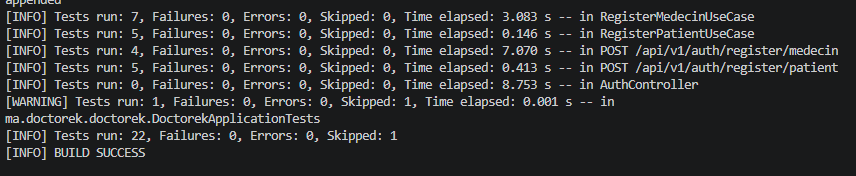
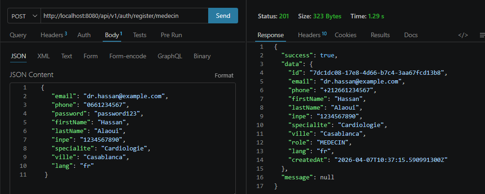
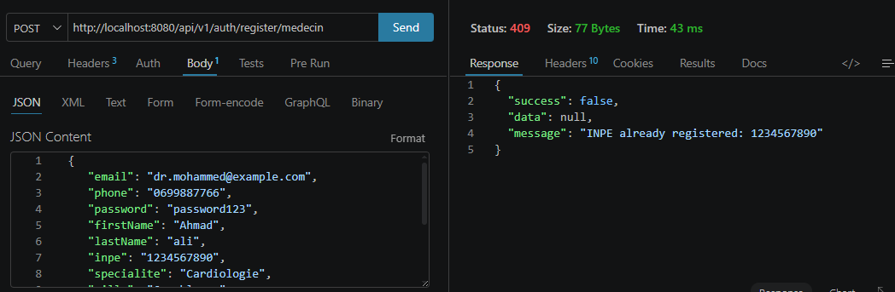
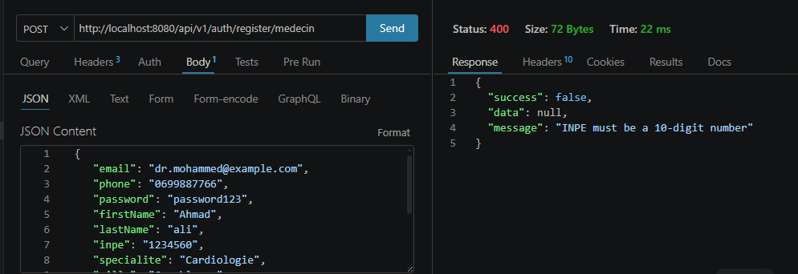

# US-03 — Inscription Médecin

**Module** : `auth`  
**Endpoint** : `POST /api/v1/auth/register/medecin`  
**Stack** : Spring Boot 3.5.13 · Java 17 · PostgreSQL · Flyway  
**Tests** : 11 tests unitaires/slice (JUnit 5 + Mockito + MockMvc) — tous verts

---

## Table des matières

1. [Vue d'ensemble](#1-vue-densemble)
2. [Architecture en couches (DDD)](#2-architecture-en-couches-ddd)
3. [Design patterns utilisés](#3-design-patterns-utilisés)
4. [Modèle de données](#4-modèle-de-données)
5. [Contrat d'API](#5-contrat-dapi)
6. [Validation et normalisation](#6-validation-et-normalisation)
7. [Sécurité](#7-sécurité)
8. [Stratégie de test](#8-stratégie-de-test)
9. [Justifications techniques](#9-justifications-techniques)
10. [Preuves d'exécution](#10-preuves-dexécution)

---

## 1. Vue d'ensemble

L'inscription médecin étend le module `auth` pour accueillir un second type d'utilisateur professionnel. En plus des champs communs (email, téléphone, mot de passe), le médecin fournit :

- un **INPE** (Identifiant National du Praticien et de l'Établissement) — 10 chiffres, unique en base
- une **spécialité** médicale (ex. Cardiologie, Pédiatrie)
- une **ville** d'exercice
- une **adresse** de cabinet (optionnelle)

Le rôle `MEDECIN` est attribué automatiquement. Le flux se termine par un `201 Created` contenant les données publiques du médecin, **sans jamais exposer le mot de passe**.

---

## 2. Architecture en couches (DDD)

L'US-03 suit exactement la même architecture en couches que l'US-02, en étendant chaque couche avec les concepts spécifiques au médecin :

```
auth/
├── domain/               ← Couche Domaine
│   ├── User.java               entité JPA (inpe, specialite, ville, adresse ajoutés)
│   ├── Role.java               enum PATIENT | MEDECIN | CLINIQUE | ADMIN
│   ├── UserRepository.java     +existsByInpe(String inpe)
│   ├── EmailAlreadyExistsException.java
│   ├── PhoneAlreadyExistsException.java
│   └── InpeAlreadyExistsException.java    ← nouveau
│
├── application/          ← Couche Application
│   ├── RegisterPatientUseCase.java
│   ├── RegisterMedecinUseCase.java        ← nouveau
│   └── dto/
│       ├── RegisterMedecinRequest.java    ← nouveau (record + Bean Validation)
│       └── MedecinRegisteredResponse.java ← nouveau (record, sans password)
│
├── infrastructure/       ← Couche Infrastructure
│   ├── SpringDataUserRepository.java      +existsByInpe()
│   ├── JpaUserRepository.java             +existsByInpe() (délégation)
│   ├── PasswordEncoderConfig.java
│   └── SecurityConfig.java
│
└── web/                  ← Couche Présentation
    └── AuthController.java                +POST /register/medecin

shared/
└── web/
    ├── ApiResponse.java
    └── GlobalExceptionHandler.java        +handleInpeConflict()
```

### Flux d'une requête

```
HTTP POST /api/v1/auth/register/medecin
    │
    ▼
AuthController              [web]
  @Valid @RequestBody       ← Bean Validation (400 si invalide)
    │
    ▼
RegisterMedecinUseCase      [application]
  existsByEmail?            ← EmailAlreadyExistsException (409)
  normalizePhone()          ← 0661234567 → +212661234567
  existsByPhone?            ← PhoneAlreadyExistsException (409)
  existsByInpe?             ← InpeAlreadyExistsException (409)
  encode(password)          ← BCrypt hash
  save(User)                ← role = MEDECIN (forcé)
    │
    ▼
JpaUserRepository           [infrastructure]
  SpringDataUserRepository.save()
    │
    ▼
PostgreSQL auth.users       [base de données]
    │
    ▼
MedecinRegisteredResponse.from(saved)
    │
    ▼
ResponseEntity 201 Created { success: true, data: {...} }
```

---

## 3. Design patterns utilisés

Les mêmes patterns qu'en US-02 s'appliquent. Seules les spécificités médecin sont détaillées ici.

### 3.1 Use Case Pattern — rôle forcé dans l'application

```java
User user = User.builder()
    .email(request.email().toLowerCase().strip())
    .phone(normalizedPhone)
    .password(passwordEncoder.encode(request.password()))
    .role(Role.MEDECIN)          // jamais fourni par le client
    .inpe(request.inpe().strip())
    .specialite(request.specialite().strip())
    .ville(request.ville().strip())
    .adresse(request.adresse() != null ? request.adresse().strip() : null)
    .lang(request.lang())
    .build();
```

Le rôle `MEDECIN` est attribué **dans le use case**, jamais lu depuis la requête du client. Un patient malveillant ne peut pas s'auto-attribuer un rôle médecin.

### 3.2 Triple vérification d'unicité

```java
if (userRepository.existsByEmail(request.email()))
    throw new EmailAlreadyExistsException(request.email());

String normalizedPhone = normalizePhone(request.phone());
if (userRepository.existsByPhone(normalizedPhone))
    throw new PhoneAlreadyExistsException(normalizedPhone);

if (userRepository.existsByInpe(request.inpe()))
    throw new InpeAlreadyExistsException(request.inpe());
```

L'INPE est un identifiant officiel délivré par le Ministère de la Santé marocain. Sa vérification d'unicité garantit qu'un praticien ne peut pas créer plusieurs comptes avec le même numéro professionnel.

### 3.3 Exception de domaine dédiée

```java
public class InpeAlreadyExistsException extends RuntimeException {
    public InpeAlreadyExistsException(String inpe) {
        super("INPE already registered: " + inpe);
    }
}
```

Chaque type de conflit métier a sa propre exception, mappée dans le `GlobalExceptionHandler` vers un `409 Conflict` avec un message explicite.

### 3.4 Champ optionnel géré dans le domaine

```java
.adresse(request.adresse() != null ? request.adresse().strip() : null)
```

L'adresse est le seul champ optionnel du médecin. La logique `null`-safe est encapsulée dans le use case, pas dans le controller.

---

## 4. Modèle de données

### Migration Flyway V3

```sql
-- V3__add_medecin_fields.sql
ALTER TABLE auth.users
    ADD COLUMN IF NOT EXISTS inpe       VARCHAR(10)  UNIQUE,
    ADD COLUMN IF NOT EXISTS specialite VARCHAR(100),
    ADD COLUMN IF NOT EXISTS ville      VARCHAR(100),
    ADD COLUMN IF NOT EXISTS adresse    TEXT;

CREATE INDEX IF NOT EXISTS idx_users_inpe ON auth.users(inpe);
```

**Choix notables** :
- `IF NOT EXISTS` — idempotence garantie, Flyway rejoue les migrations en environnement de test.
- `UNIQUE` sur `inpe` — contrainte d'unicité au niveau base (deuxième filet de sécurité après la vérification applicative).
- `VARCHAR(10)` — l'INPE marocain fait exactement 10 chiffres ; le type limite les valeurs aberrantes.
- `TEXT` pour `adresse` — longueur variable, pas de contrainte arbitraire sur la taille d'une adresse postale.
- Index sur `inpe` — utilisé dans `existsByInpe()`, garantit O(log n).

### Structure de la table après V3

| Colonne | Type | Contrainte | Médecin | Patient |
|---------|------|-----------|---------|---------|
| `id` | UUID | PK | ✓ | ✓ |
| `email` | VARCHAR(255) | UNIQUE NOT NULL | ✓ | ✓ |
| `phone` | VARCHAR(20) | UNIQUE | ✓ | ✓ |
| `password` | VARCHAR(255) | NOT NULL | ✓ | ✓ |
| `first_name` | VARCHAR(100) | NOT NULL | ✓ | ✓ |
| `last_name` | VARCHAR(100) | NOT NULL | ✓ | ✓ |
| `role` | VARCHAR(20) | NOT NULL | `MEDECIN` | `PATIENT` |
| `lang` | VARCHAR(5) | NOT NULL | ✓ | ✓ |
| `inpe` | VARCHAR(10) | UNIQUE | ✓ | NULL |
| `specialite` | VARCHAR(100) | | ✓ | NULL |
| `ville` | VARCHAR(100) | | ✓ | NULL |
| `adresse` | TEXT | | optionnel | NULL |

---

## 5. Contrat d'API

### Requête

```
POST /api/v1/auth/register/medecin
Content-Type: application/json
```

```json
{
  "email":      "dr.hassan@example.com",
  "phone":      "0661234567",
  "password":   "password123",
  "firstName":  "Hassan",
  "lastName":   "Alaoui",
  "inpe":       "1234567890",
  "specialite": "Cardiologie",
  "ville":      "Casablanca",
  "adresse":    "Rue des Fleurs 10",
  "lang":       "fr"
}
```

| Champ | Type | Requis | Contrainte |
|-------|------|--------|-----------|
| `email` | string | oui | Format email valide |
| `phone` | string | oui | Numéro marocain : `^(\+212\|0)(6\|7)[0-9]{8}$` |
| `password` | string | oui | Minimum 8 caractères |
| `firstName` | string | oui | Max 100 caractères |
| `lastName` | string | oui | Max 100 caractères |
| `inpe` | string | oui | Exactement 10 chiffres : `^[0-9]{10}$` |
| `specialite` | string | oui | Max 100 caractères |
| `ville` | string | oui | Max 100 caractères |
| `adresse` | string | non | Max 500 caractères |
| `lang` | string | non | `fr` (défaut) ou `ar` |

### Réponses

**201 Created — Inscription réussie**
```json
{
  "success": true,
  "data": {
    "id":         "550e8400-e29b-41d4-a716-446655440001",
    "email":      "dr.hassan@example.com",
    "phone":      "+212661234567",
    "firstName":  "Hassan",
    "lastName":   "Alaoui",
    "inpe":       "1234567890",
    "specialite": "Cardiologie",
    "ville":      "Casablanca",
    "role":       "MEDECIN",
    "lang":       "fr",
    "createdAt":  "2026-04-07T10:30:00Z"
  },
  "message": null
}
```

> Le champ `password` n'est **jamais** présent dans la réponse.

**400 Bad Request — INPE invalide**
```json
{
  "success": false,
  "data":    null,
  "message": "INPE must be exactly 10 digits"
}
```

**409 Conflict — INPE déjà enregistré**
```json
{
  "success": false,
  "data":    null,
  "message": "INPE already registered: 1234567890"
}
```

---

## 6. Validation et normalisation

### Validation en deux temps (identique à US-02)

1. **Validation syntaxique** (couche web) : Bean Validation via `@Valid`. Déclenche un `MethodArgumentNotValidException` → 400 Bad Request.
2. **Validation sémantique** (couche application) : unicité de l'email, du téléphone et de l'INPE. → 409 Conflict.

### Validation de l'INPE

```java
@NotBlank
@Pattern(regexp = "^[0-9]{10}$", message = "INPE must be exactly 10 digits")
String inpe
```

Le pattern `^[0-9]{10}$` accepte uniquement 10 chiffres consécutifs. Toute lettre, tiret ou espace déclenche une erreur 400 avant même d'atteindre la base de données.

### Normalisation du numéro de téléphone

```java
private String normalizePhone(String phone) {
    String cleaned = phone.strip();
    if (cleaned.startsWith("0")) {
        return "+212" + cleaned.substring(1);  // 0661234567 → +212661234567
    }
    return cleaned;
}
```

Même logique qu'en US-02. Les médecins utilisent fréquemment les numéros 06 (Orange) et 07 (IAM), tous deux valides selon le pattern marocain.

---

## 7. Sécurité

### Rôle non contrôlable par le client

Le champ `role` n'est pas présent dans `RegisterMedecinRequest`. Il est attribué exclusivement dans `RegisterMedecinUseCase` :

```java
.role(Role.MEDECIN)  // hardcodé dans le use case
```

Un attaquant qui enverrait `"role": "ADMIN"` dans le corps de la requête verrait ce champ simplement ignoré par la désérialisation.

### Endpoint public (identique à US-02)

```java
.requestMatchers("/api/v1/auth/**").permitAll()
```

L'inscription ne nécessite pas d'authentification préalable. Spring Security est configuré en mode stateless sans CSRF (API REST).

### Hachage BCrypt (identique à US-02)

Le mot de passe est haché avec `BCryptPasswordEncoder` (coût 10) avant persistance. Jamais retourné dans la réponse.

---

## 8. Stratégie de test

### Organisation

```
src/test/java/ma/doctorek/doctorek/
├── auth/
│   ├── application/
│   │   ├── RegisterPatientUseCaseTest.java   (5 tests)
│   │   └── RegisterMedecinUseCaseTest.java   (7 tests) ← nouveau
│   └── web/
│       └── AuthControllerTest.java
│           ├── @Nested RegisterPatient        (5 tests)
│           └── @Nested RegisterMedecin        (4 tests) ← nouveau
└── DoctorekApplicationTests.java
```

### Tests unitaires du Use Case (`@ExtendWith(MockitoExtension.class)`)

| Test | Scénario |
|------|----------|
| `execute_withValidData_createsMedecin` | Happy path — médecin créé, réponse correcte |
| `execute_withExistingEmail_throwsException` | Email dupliqué → `EmailAlreadyExistsException`, `save()` non appelé |
| `execute_withExistingPhone_throwsException` | Téléphone dupliqué → `PhoneAlreadyExistsException`, `save()` non appelé |
| `execute_withExistingInpe_throwsException` | INPE dupliqué → `InpeAlreadyExistsException`, `save()` non appelé |
| `execute_passwordIsEncoded` | `ArgumentCaptor` vérifie que le hash BCrypt est persisté, jamais le mot de passe en clair |
| `execute_phoneIsNormalized` | `0661234567` stocké comme `+212661234567` |
| `execute_roleIsAlwaysMedecin` | Le rôle `MEDECIN` est forcé indépendamment de toute entrée client |

### Tests de slice web (`@WebMvcTest`)

```java
@WebMvcTest(controllers = AuthController.class)
@Import({GlobalExceptionHandler.class, SecurityConfig.class})
@Nested
@DisplayName("POST /api/v1/auth/register/medecin")
class RegisterMedecin { ... }
```

| Test | Scénario | Status attendu |
|------|----------|---------------|
| `register_withValidRequest_returns201` | Requête valide → 201, `data.role = MEDECIN`, `data.inpe`, `data.specialite` présents, pas de `data.password` | 201 |
| `register_withInvalidInpe_returns400` | INPE `"INPE-INVALID"` (non numérique) → 400 | 400 |
| `register_withExistingEmail_returns409` | Use case lance `EmailAlreadyExistsException` → 409 | 409 |
| `register_withExistingInpe_returns409` | Use case lance `InpeAlreadyExistsException` → 409, message `"INPE already registered: 1234567890"` | 409 |

---

## 9. Justifications techniques

### Pourquoi l'INPE dans `auth` et non dans un module `medecin` ?

L'INPE est un **critère d'identité** (comme l'email ou le téléphone) : son unicité doit être garantie au moment de l'inscription, dans la même transaction que la création du compte. Le placer dans un module `medecin` séparé créerait une fenêtre de race condition entre la création du compte et la vérification de l'INPE.

### Pourquoi une seule table `auth.users` pour patients et médecins ?

La table unique (pattern **Single Table Inheritance**) simplifie les requêtes cross-rôle (ex. recherche par email lors du login) et évite une jointure à chaque authentification. Les colonnes médecin (`inpe`, `specialite`, `ville`, `adresse`) sont `NULL` pour les patients — un compromis acceptable à ce stade de la base de données.

### Pourquoi `VARCHAR(10)` et non `INTEGER` pour l'INPE ?

L'INPE peut contenir des zéros en tête (ex. `0012345678`). Un type `INTEGER` tronquerait ces zéros, rendant l'identifiant invalide. `VARCHAR(10)` préserve le format exact.

### Pourquoi trois vérifications d'unicité séquentielles et non en parallèle ?

Les vérifications sont intentionnellement séquentielles pour retourner un message d'erreur précis (email, téléphone ou INPE) et non un message générique. De plus, elles partagent la même transaction : une vérification en parallèle nécessiterait des verrous explicites pour éviter les race conditions.

### Pourquoi `role` forcé dans le use case plutôt que lu depuis la requête ?

Principe du **moindre privilège** : le client fournit uniquement les données nécessaires à son cas d'usage. L'attribution du rôle est une décision métier qui appartient au système, pas à l'utilisateur. Si demain un flow d'approbation est ajouté (un admin valide l'INPE), seul le use case doit changer.

---

## 10. Preuves d'exécution

### 10.1 — Suite de tests TDD (BUILD SUCCESS)

**Commande**
```bash
cd doctorek-backend
mvn test | Select-String -Pattern "Tests run|BUILD"
```

**Résultat** :
```
Tests run: 7  →  RegisterMedecinUseCaseTest              (Failures: 0, Errors: 0)
Tests run: 5  →  RegisterPatientUseCaseTest               (Failures: 0, Errors: 0)
Tests run: 4  →  POST /api/v1/auth/register/medecin       (Failures: 0, Errors: 0)
Tests run: 5  →  POST /api/v1/auth/register/patient       (Failures: 0, Errors: 0)
Tests run: 22, Failures: 0, Errors: 0, Skipped: 1
BUILD SUCCESS
```



---

### 10.2 — Inscription réussie (201 Created)

**Commande (Postman)**
```
POST http://localhost:8080/api/v1/auth/register/medecin
Content-Type: application/json

{
  "email":      "dr.hassan@doctorek.ma",
  "phone":      "0661234567",
  "password":   "password123",
  "firstName":  "Hassan",
  "lastName":   "Alaoui",
  "inpe":       "1234567890",
  "specialite": "Cardiologie",
  "ville":      "Casablanca",
  "lang":       "fr"
}
```

**Observations** :
- Téléphone normalisé : `+212661234567`
- Rôle attribué automatiquement : `MEDECIN`
- INPE retourné dans la réponse : `1234567890`
- Champ `password` absent de la réponse



---

### 10.3 — INPE dupliqué (409 Conflict)

**Commande** : même requête envoyée une seconde fois (INPE déjà enregistré)

```
POST http://localhost:8080/api/v1/auth/register/medecin
→ Status: 409  |  Time: ~50 ms
```

**Réponse** :
```json
{
  "success": false,
  "data":    null,
  "message": "INPE already registered: 1234567890"
}
```



---

### 10.4 — INPE invalide (400 Bad Request)

**Corps envoyé** : INPE non numérique (`"INPE-INVALID"`)

```
POST http://localhost:8080/api/v1/auth/register/medecin
→ Status: 400  |  Time: ~10 ms
```

**Réponse** :
```json
{
  "success": false,
  "data":    null,
  "message": "INPE must be exactly 10 digits"
}
```

La validation Bean Validation intercepte la requête avant même d'atteindre le use case ou la base de données.


