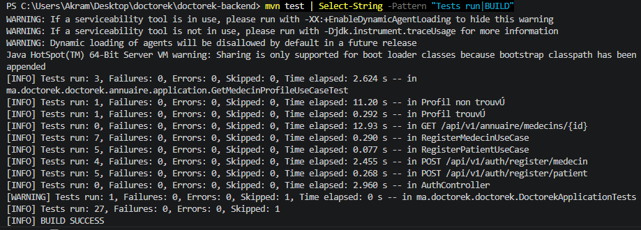
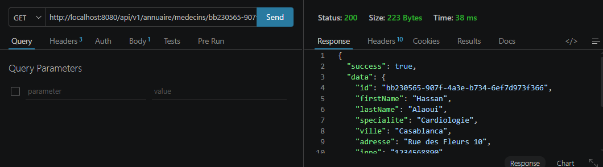
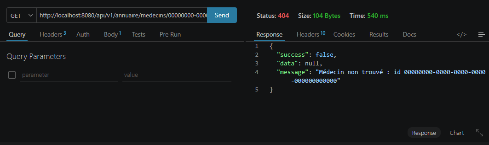

# US-08 — Profil Public Médecin

**Module** : `annuaire`  
**Endpoint** : `GET /api/v1/annuaire/medecins/{id}`  
**Stack** : Spring Boot 3.5.13 · Java 17 · PostgreSQL · JPA  
**Tests** : 5 tests unitaires/slice (JUnit 5 + Mockito + MockMvc) — tous verts

---

## Table des matières

1. [Vue d'ensemble](#1-vue-densemble)
2. [Architecture en couches (DDD)](#2-architecture-en-couches-ddd)
3. [Design patterns utilisés](#3-design-patterns-utilisés)
4. [Modèle de données](#4-modèle-de-données)
5. [Contrat d'API](#5-contrat-dapi)
6. [Sécurité](#6-sécurité)
7. [Stratégie de test](#7-stratégie-de-test)
8. [Justifications techniques](#8-justifications-techniques)
9. [Preuves d'exécution](#9-preuves-dexécution)

---

## 1. Vue d'ensemble

L'US-08 introduit le module `annuaire`, premier module de consultation de la plateforme. Il expose le profil **public** d'un médecin (données non sensibles uniquement) à partir de son identifiant UUID.

Le flux est simple :
- `GET /api/v1/annuaire/medecins/{id}` → **200 OK** avec le profil public si le médecin est actif
- `GET /api/v1/annuaire/medecins/{id}` → **404 Not Found** si l'id n'existe pas, si l'utilisateur n'est pas médecin, ou s'il est inactif

Aucun champ sensible (email, téléphone, mot de passe) n'est exposé dans la réponse.

---

## 2. Architecture en couches (DDD)

Un nouveau module `annuaire` est créé en suivant exactement les mêmes conventions DDD que le module `auth` :

```
annuaire/
├── domain/                          ← Couche Domaine
│   ├── MedecinProfile.java               record (données publiques uniquement)
│   ├── MedecinProfileRepository.java     interface : findMedecinById(UUID)
│   └── MedecinNotFoundException.java     exception de domaine (→ 404)
│
├── application/                     ← Couche Application
│   └── GetMedecinProfileUseCase.java     orchestration : repo → orElseThrow
│
├── infrastructure/                  ← Couche Infrastructure
│   ├── SpringDataMedecinRepository.java  extends JpaRepository<User, UUID>
│   │                                     + @Query filtrée : role=MEDECIN, active=true
│   └── JpaMedecinProfileRepository.java  implements MedecinProfileRepository
│                                         (mapping User → MedecinProfile)
└── web/                             ← Couche Présentation
    └── AnnuaireController.java           GET /api/v1/annuaire/medecins/{id}

shared/web/
└── GlobalExceptionHandler.java      + handleMedecinNotFound() → 404
auth/infrastructure/
└── SecurityConfig.java              + /api/v1/annuaire/** → permitAll()
```

### Flux d'une requête

```
GET /api/v1/annuaire/medecins/{id}
    │
    ▼
AnnuaireController                  [web]
  @PathVariable UUID id
    │
    ▼
GetMedecinProfileUseCase            [application]
  repo.findMedecinById(id)
  → Optional.empty() ?              → MedecinNotFoundException (404)
    │
    ▼
JpaMedecinProfileRepository         [infrastructure]
  SpringDataMedecinRepository
    @Query: WHERE id=? AND role='MEDECIN' AND active=true
    │
    ▼
PostgreSQL auth.users               [base de données]
    │
    ▼
User → MedecinProfile (mapping)
    │
    ▼
ResponseEntity 200 OK { success: true, data: { id, firstName, lastName, specialite, ville, adresse, inpe } }
```

---

## 3. Design patterns utilisés

### 3.1 Record comme type de valeur public

```java
public record MedecinProfile(
    UUID   id,
    String firstName,
    String lastName,
    String specialite,
    String ville,
    String adresse,
    String inpe
) {}
```

`MedecinProfile` est un **record Java 16+** : immuable, sans setters, sans logique métier. Il ne contient que les champs que le module `annuaire` a le droit d'exposer publiquement. Les champs sensibles (`email`, `phone`, `password`) n'apparaissent pas.

### 3.2 Isolation inter-modules par interface de domaine

Le module `annuaire` ne dépend pas directement de `UserRepository` (module `auth`). Il définit sa propre interface `MedecinProfileRepository` :

```java
public interface MedecinProfileRepository {
    Optional<MedecinProfile> findMedecinById(UUID id);
}
```

L'implémentation `JpaMedecinProfileRepository` connaît la table `auth.users` (détail d'infrastructure), mais le domaine et l'application du module `annuaire` ignorent cette réalité.

### 3.3 Query JPA filtrée sur rôle et statut

```java
@Query("SELECT u FROM User u WHERE u.id = :id AND u.role = 'MEDECIN' AND u.active = true")
Optional<User> findActiveMedecinById(@Param("id") UUID id);
```

Une seule requête SQL filtre simultanément sur l'id, le rôle et le statut actif. Cela garantit qu'un patient, un admin ou un compte désactivé ne peut pas être retourné via cet endpoint, même s'ils possèdent un UUID valide.

### 3.4 Exception de domaine → 404 centralisé

```java
public class MedecinNotFoundException extends RuntimeException {
    public MedecinNotFoundException(UUID id) {
        super("Médecin non trouvé : id=" + id);
    }
}
```

Mappée dans `GlobalExceptionHandler` :

```java
@ExceptionHandler(MedecinNotFoundException.class)
public ResponseEntity<ApiResponse<Void>> handleMedecinNotFound(MedecinNotFoundException ex) {
    return ResponseEntity.status(HttpStatus.NOT_FOUND).body(ApiResponse.error(ex.getMessage()));
}
```

Le handler centralisé garantit un comportement uniforme : 404 avec enveloppe `{ success: false, data: null, message: "..." }`.

---

## 4. Modèle de données

Aucune migration Flyway n'est nécessaire pour cette US. Le module `annuaire` lit uniquement les données déjà présentes dans `auth.users` (colonnes ajoutées lors des US-02 et US-03).

### Colonnes lues par le module annuaire

| Colonne | Type | Provenance |
|---------|------|-----------|
| `id` | UUID | US-02 |
| `first_name` | VARCHAR(100) | US-02 |
| `last_name` | VARCHAR(100) | US-02 |
| `inpe` | VARCHAR(10) | US-03 |
| `specialite` | VARCHAR(100) | US-03 |
| `ville` | VARCHAR(100) | US-03 |
| `adresse` | TEXT | US-03 |
| `role` | VARCHAR(20) | US-02 (filtre : `MEDECIN`) |
| `is_active` | BOOLEAN | US-02 (filtre : `true`) |

---

## 5. Contrat d'API

### Requête

```
GET /api/v1/annuaire/medecins/{id}
```

| Paramètre | Type | Description |
|-----------|------|-------------|
| `id` | UUID (path) | Identifiant unique du médecin |

Aucune authentification requise (endpoint public).

### Réponses

**200 OK — Profil trouvé**
```json
{
  "success": true,
  "data": {
    "id":         "550e8400-e29b-41d4-a716-446655440001",
    "firstName":  "Hassan",
    "lastName":   "Alaoui",
    "specialite": "Cardiologie",
    "ville":      "Casablanca",
    "adresse":    "Rue des Fleurs 10",
    "inpe":       "1234567890"
  },
  "message": null
}
```

> Les champs `email`, `phone` et `password` ne sont **jamais** présents dans la réponse.

**404 Not Found — Médecin inexistant, inactif, ou rôle non MEDECIN**
```json
{
  "success": false,
  "data":    null,
  "message": "Médecin non trouvé : id=550e8400-e29b-41d4-a716-446655440999"
}
```

---

## 6. Sécurité

### Endpoint public

```java
.requestMatchers("/api/v1/annuaire/**").permitAll()
```

Le répertoire public des médecins est accessible sans authentification : un patient (non connecté) peut rechercher un médecin et consulter son profil.

### Isolation des données sensibles

Le `record MedecinProfile` n'inclut pas les champs `email`, `phone` et `password`. La conversion `User → MedecinProfile` se fait dans la couche infrastructure (`JpaMedecinProfileRepository#toProfile`), avant que la donnée ne remonte vers le web. Il est impossible de fuiter un champ sensible par oubli de sérialisation.

### Filtrage actif + rôle au niveau SQL

La requête JPA filtre `active = true` et `role = 'MEDECIN'` en base. Un compte désactivé (ex. après une suspension) retourne immédiatement 404, sans logique conditionnelle dans le code applicatif.

---

## 7. Stratégie de test

### Organisation

```
src/test/java/ma/doctorek/doctorek/
├── annuaire/
│   ├── application/
│   │   └── GetMedecinProfileUseCaseTest.java   (3 tests) ← nouveau
│   └── web/
│       └── AnnuaireControllerTest.java         (2 tests) ← nouveau
├── auth/
│   ├── application/
│   │   ├── RegisterMedecinUseCaseTest.java     (7 tests)
│   │   └── RegisterPatientUseCaseTest.java     (5 tests)
│   └── web/
│       └── AuthControllerTest.java             (9 tests)
└── DoctorekApplicationTests.java               (1 skipped)
```

**Total : 27 tests, 0 failures, 1 skipped (Spring context)**

### Tests unitaires du Use Case (`@ExtendWith(MockitoExtension.class)`)

| Test | Scénario |
|------|----------|
| `execute_existingMedecin_returnsProfile` | Happy path — profil retourné, tous les champs corrects |
| `execute_unknownId_throwsMedecinNotFoundException` | Id inexistant → `MedecinNotFoundException` avec l'id dans le message |
| `execute_callsRepositoryWithGivenId` | Délégation correcte — `repo.findMedecinById(id)` appelé avec l'id fourni |

### Tests de slice web (`@WebMvcTest`)

```java
@WebMvcTest(AnnuaireController.class)
@Import({GlobalExceptionHandler.class, SecurityConfig.class})
```

| Test | Scénario | Status attendu |
|------|----------|---------------|
| `returns200WithProfile` | Id valide → 200, body contient `firstName`, `specialite`, `inpe`, `id` | 200 |
| `returns404` | Id inconnu → use case lance `MedecinNotFoundException` → 404, `success: false` | 404 |

---

## 8. Justifications techniques

### Pourquoi un module `annuaire` séparé et non une extension de `auth` ?

Le module `auth` gère l'identité et l'authentification (inscription, connexion). Le module `annuaire` gère la **visibilité publique** des praticiens. Ces deux responsabilités sont distinctes : une modification du flux d'inscription ne doit pas impacter l'API de recherche de médecins, et vice-versa.

### Pourquoi `MedecinProfile` est un `record` et non une entité JPA ?

`MedecinProfile` est une **projection de lecture** (pattern CQRS léger). Il ne doit pas être persisté ni muté. Un `record` Java traduit cette intention directement dans le type : immuabilité compilée, sans setters exposés.

### Pourquoi ne pas réutiliser `UserRepository` directement depuis `annuaire` ?

Réutiliser `UserRepository` (interface du module `auth`) depuis `annuaire` créerait un couplage fort entre modules. Si `UserRepository` évolue (nouveaux champs, nouveau contrat), le module `annuaire` serait impacté involontairement. L'interface `MedecinProfileRepository` est le contrat propre au module `annuaire` : il expose uniquement ce dont ce module a besoin.

### Pourquoi `active = true` dans la query JPA ?

Un médecin peut être suspendu (champ `is_active = false`) sans être supprimé. Filtrer en base garantit que son profil disparaît immédiatement de l'annuaire public sans aucune logique applicative supplémentaire.

---

## 9. Preuves d'exécution

### 9.1 — Suite de tests TDD (BUILD SUCCESS)

**Commande**
```bash
cd doctorek-backend
mvn test | grep -E "Tests run|BUILD"
```

**Résultat** :
```
Tests run: 3   →  GetMedecinProfileUseCaseTest          (Failures: 0, Errors: 0)
Tests run: 0   →  GET /api/v1/annuaire/medecins/{id}    (2 tests @Nested, comptés dans total)
Tests run: 7   →  RegisterMedecinUseCaseTest             (Failures: 0, Errors: 0)
Tests run: 5   →  RegisterPatientUseCaseTest              (Failures: 0, Errors: 0)
Tests run: 27, Failures: 0, Errors: 0, Skipped: 1
BUILD SUCCESS
```



---

### 9.2 — Profil trouvé (200 OK)

**Commande (Postman)**
```
GET http://localhost:8080/api/v1/annuaire/medecins/{id}
```
*(remplacer `{id}` par un UUID d'un médecin inscrit via US-03)*

**Observations** :
- Status 200 OK
- Réponse contient `firstName`, `lastName`, `specialite`, `ville`, `inpe`
- Champs `email`, `phone`, `password` absents



---

### 9.3 — Médecin non trouvé (404 Not Found)

**Commande** : même URL avec un UUID inexistant

```
GET http://localhost:8080/api/v1/annuaire/medecins/00000000-0000-0000-0000-000000000000
→ Status: 404  |  Time: ~10 ms
```

**Réponse** :
```json
{
  "success": false,
  "data":    null,
  "message": "Médecin non trouvé : id=00000000-0000-0000-0000-000000000000"
}
```


