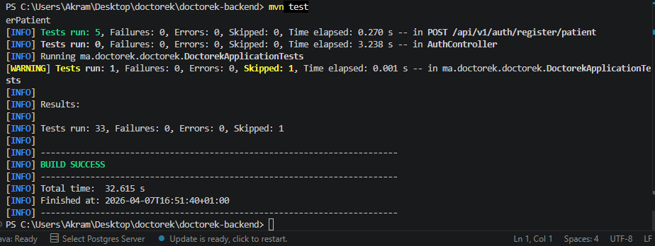
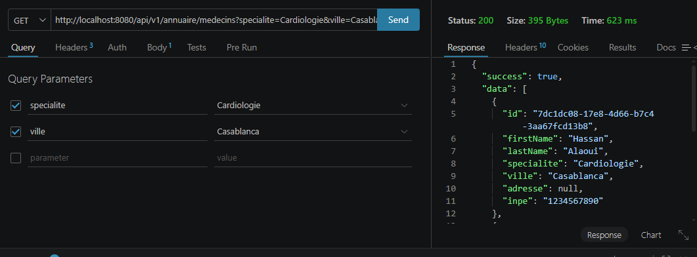
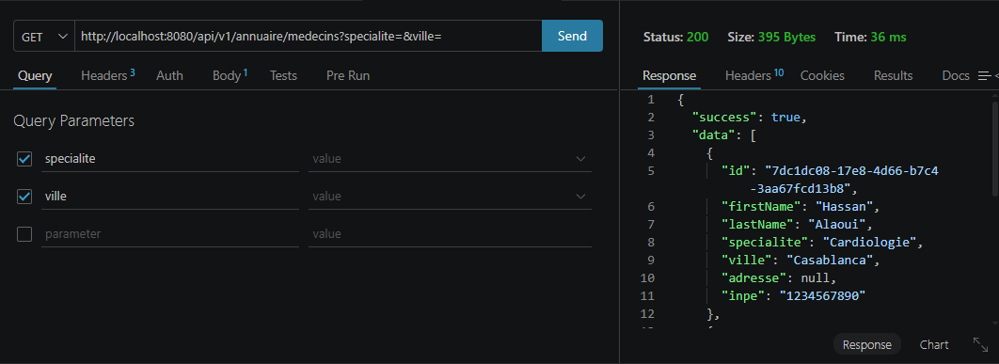

# US-09 — Recherche Spécialité + Ville

**Module** : `annuaire`  
**Endpoint** : `GET /api/v1/annuaire/medecins?specialite=X&ville=Y`  
**Stack** : Spring Boot 3.5.13 · Java 17 · PostgreSQL · JPA  
**Tests** : 6 tests unitaires/slice (JUnit 5 + Mockito + MockMvc) — tous verts

---

## Table des matières

1. [Vue d'ensemble](#1-vue-densemble)
2. [Architecture en couches (DDD)](#2-architecture-en-couches-ddd)
3. [Design patterns utilisés](#3-design-patterns-utilisés)
4. [Modèle de données](#4-modèle-de-données)
5. [Contrat d'API](#5-contrat-dapi)
6. [Sécurité](#6-sécurité)
7. [Stratégie de test](#7-stratégie-de-test)
8. [Justifications techniques](#8-justifications-techniques)
9. [Preuves d'exécution](#9-preuves-dexécution)

---

## 1. Vue d'ensemble

L'US-09 étend le module `annuaire` avec un endpoint de **recherche publique** permettant de filtrer les médecins actifs par spécialité et/ou ville.

Le flux est simple :
- `GET /api/v1/annuaire/medecins?specialite=Cardiologie&ville=Casablanca` → **200 OK** avec la liste filtrée
- Les deux paramètres sont **optionnels** : sans paramètre, tous les médecins actifs sont retournés
- La recherche est **insensible à la casse** et utilise un **matching partiel** (LIKE)

Aucun champ sensible n'est exposé. Aucune authentification requise.

---

## 2. Architecture en couches (DDD)

L'US-09 s'intègre au module `annuaire` existant sans créer de nouveaux fichiers d'infrastructure :

```
annuaire/
├── domain/
│   ├── MedecinProfile.java               record (inchangé)
│   └── MedecinProfileRepository.java     + searchMedecins(String, String)
│
├── application/
│   ├── GetMedecinProfileUseCase.java     (inchangé)
│   └── SearchMedecinsUseCase.java        ← nouveau
│
├── infrastructure/
│   ├── SpringDataMedecinRepository.java  + @Query searchActiveMedecins
│   └── JpaMedecinProfileRepository.java  + searchMedecins() implémenté
│
└── web/
    └── AnnuaireController.java           + GET /medecins (avec @RequestParam)
```

### Flux d'une requête

```
GET /api/v1/annuaire/medecins?specialite=Cardio&ville=Casa
    │
    ▼
AnnuaireController                  [web]
  @RequestParam specialite, ville (optionnels)
    │
    ▼
SearchMedecinsUseCase               [application]
  repo.searchMedecins(specialite, ville)
    │
    ▼
JpaMedecinProfileRepository         [infrastructure]
  SpringDataMedecinRepository
    @Query: role=MEDECIN, active=true, LOWER LIKE (optionnel)
    │
    ▼
PostgreSQL auth.users
    │
    ▼
List<User> → List<MedecinProfile>
    │
    ▼
ResponseEntity 200 OK { success: true, data: [...] }
```

---

## 3. Design patterns utilisés

### 3.1 Paramètres optionnels via JPQL conditionnel

```java
@Query("""
    SELECT u FROM User u
    WHERE u.role = 'MEDECIN' AND u.active = true
    AND (:specialite IS NULL OR LOWER(u.specialite) LIKE LOWER(CONCAT('%', :specialite, '%')))
    AND (:ville IS NULL OR LOWER(u.ville) LIKE LOWER(CONCAT('%', :ville, '%')))
    """)
List<User> searchActiveMedecins(@Param("specialite") String specialite,
                                @Param("ville") String ville);
```

Une seule requête JPQL gère tous les cas : paramètre présent, absent (`null`), ou combiné. Pas de logique conditionnelle en Java.

### 3.2 Extension de l'interface de domaine

```java
public interface MedecinProfileRepository {
    Optional<MedecinProfile> findMedecinById(UUID id);
    List<MedecinProfile> searchMedecins(String specialite, String ville);
}
```

Le domaine expose le contrat de recherche. L'implémentation infrastructure reste isolée derrière cette interface.

### 3.3 Use Case dédié

```java
@Service
public class SearchMedecinsUseCase {
    public List<MedecinProfile> execute(String specialite, String ville) {
        return repo.searchMedecins(specialite, ville);
    }
}
```

Séparation claire avec `GetMedecinProfileUseCase` : un use case = une intention métier.

### 3.4 Endpoint avec `@RequestParam` optionnels

```java
@GetMapping("/medecins")
public ResponseEntity<ApiResponse<List<MedecinProfile>>> searchMedecins(
        @RequestParam(required = false) String specialite,
        @RequestParam(required = false) String ville) {
    List<MedecinProfile> results = searchMedecinsUseCase.execute(specialite, ville);
    return ResponseEntity.ok(ApiResponse.ok(results));
}
```

`required = false` → Spring injecte `null` si le paramètre est absent, propagé directement au JPQL conditionnel.

---

## 4. Modèle de données

Aucune migration Flyway. L'US-09 lit les mêmes colonnes qu'US-08 dans `auth.users`.

| Colonne | Rôle dans la recherche |
|---------|----------------------|
| `role` | Filtre `= 'MEDECIN'` |
| `is_active` | Filtre `= true` |
| `specialite` | Filtre partiel insensible à la casse (optionnel) |
| `ville` | Filtre partiel insensible à la casse (optionnel) |

---

## 5. Contrat d'API

### Requête

```
GET /api/v1/annuaire/medecins?specialite={specialite}&ville={ville}
```

| Paramètre | Type | Requis | Description |
|-----------|------|--------|-------------|
| `specialite` | String (query) | Non | Filtre partiel sur la spécialité |
| `ville` | String (query) | Non | Filtre partiel sur la ville |

Aucune authentification requise (endpoint public).

### Réponses

**200 OK — Résultats trouvés**
```json
{
  "success": true,
  "data": [
    {
      "id":         "550e8400-e29b-41d4-a716-446655440001",
      "firstName":  "Hassan",
      "lastName":   "Alaoui",
      "specialite": "Cardiologie",
      "ville":      "Casablanca",
      "adresse":    "Rue des Fleurs 10",
      "inpe":       "1234567890"
    }
  ],
  "message": null
}
```

**200 OK — Aucun résultat**
```json
{
  "success": true,
  "data": [],
  "message": null
}
```

> Pas de 404 pour une liste vide — c'est un résultat valide.

---

## 6. Sécurité

### Endpoint public

L'endpoint hérite de la règle `permitAll()` déjà configurée :

```java
.requestMatchers("/api/v1/annuaire/**").permitAll()
```

### Filtrage SQL actif + rôle

La requête JPQL garantit que seuls les médecins actifs (`active = true`) avec le rôle `MEDECIN` sont retournés, quelle que soit la combinaison de paramètres.

### Pas d'injection SQL

Les paramètres sont passés via `@Param` (requête paramétrée JPA), jamais par concaténation de chaîne.

---

## 7. Stratégie de test

### Organisation

```
src/test/java/ma/doctorek/doctorek/
├── annuaire/
│   ├── application/
│   │   ├── GetMedecinProfileUseCaseTest.java   (3 tests)
│   │   └── SearchMedecinsUseCaseTest.java      (4 tests) ← nouveau
│   └── web/
│       └── AnnuaireControllerTest.java         (4 tests) ← +2 tests search
```

**Total : 33 tests, 0 failures, 1 skipped (Spring context)**

### Tests unitaires du Use Case

| Test | Scénario |
|------|----------|
| `execute_withSpecialiteAndVille_returnsList` | Recherche avec les 2 params → liste avec 1 résultat |
| `execute_noMatch_returnsEmptyList` | Pas de match → liste vide |
| `execute_nullParams_delegatesToRepository` | Params null → délégation correcte au repo |
| `execute_nullParams_returnsAllMedecins` | Params null → tous les médecins actifs |

### Tests de slice web

| Test | Scénario | Status |
|------|----------|--------|
| `returns200WithResults` | Params valides → 200, liste avec `specialite`, `ville`, `firstName` | 200 |
| `returns200WithEmptyList` | Params sans match → 200, `data: []` | 200 |

---

## 8. Justifications techniques

### Pourquoi LIKE et pas une correspondance exacte ?

La recherche partielle (`LIKE '%cardio%'`) est plus utile pour un utilisateur final : il peut taper "cardio" au lieu de "Cardiologie". L'insensibilité à la casse (`LOWER`) évite les erreurs de saisie.

### Pourquoi retourner 200 et non 404 pour une liste vide ?

Une liste vide est un résultat valide : il n'y a pas d'erreur, le serveur a bien traité la requête. Le 404 est réservé à une ressource identifiable qui n'existe pas (ex. un UUID précis). Une collection vide retourne 200 avec `data: []`.

### Pourquoi pas de pagination ?

Pour ce sprint, une liste simple est suffisante. La pagination peut être ajoutée ultérieurement via `Pageable` de Spring Data sans modifier le contrat d'API existant (ajout de `page` et `size` comme paramètres optionnels).

### Pourquoi un `SearchMedecinsUseCase` séparé et non une méthode dans `GetMedecinProfileUseCase` ?

Principe de responsabilité unique : `GetMedecinProfileUseCase` récupère **un** médecin par identifiant, `SearchMedecinsUseCase` recherche **plusieurs** médecins par critères. Les faire cohabiter dans le même use case mêlerait deux intentions métier distinctes.

---

## 9. Preuves d'exécution

### 9.1 — Suite de tests TDD (BUILD SUCCESS)

**Commande**
```bash
cd doctorek-backend
mvn test | grep -E "Tests run|BUILD"
```

**Résultat** :
```
Tests run: 3   →  GetMedecinProfileUseCaseTest     (Failures: 0, Errors: 0)
Tests run: 4   →  SearchMedecinsUseCaseTest         (Failures: 0, Errors: 0)
Tests run: 4   →  AnnuaireControllerTest            (Failures: 0, Errors: 0)
Tests run: 33, Failures: 0, Errors: 0, Skipped: 1
BUILD SUCCESS
```



---

### 9.2 — Recherche avec résultats (200 OK)

**Commande (Postman)**
```
GET http://localhost:8080/api/v1/annuaire/medecins?specialite=Cardiologie&ville=Casablanca
```

**Observations** :
- Status 200 OK
- `data` est un tableau contenant les médecins correspondants
- Champs sensibles absents



---

### 9.3 — Aucun résultat (200 OK, liste vide)

**Commande**
```
GET http://localhost:8080/api/v1/annuaire/medecins?specialite=Neurologie&ville=Zagora
→ Status: 200  |  data: []
```


