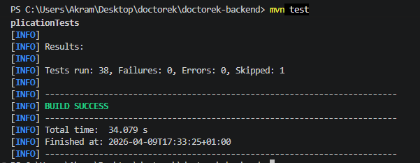
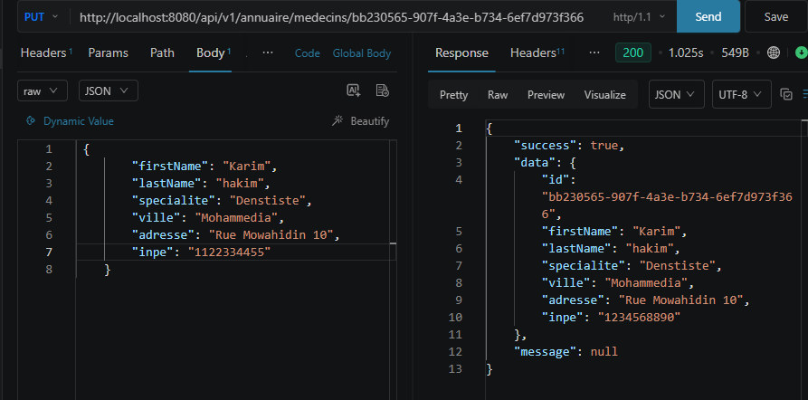
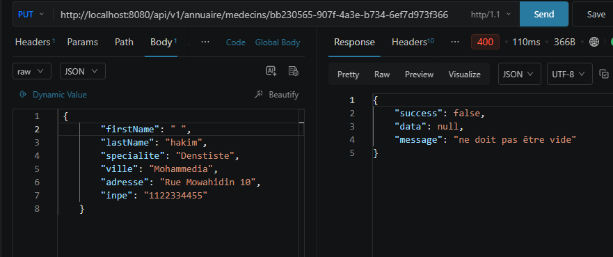

# US-10 — Complétion Profil Médecin

**Module** : `annuaire`  
**Endpoint** : `PUT /api/v1/annuaire/medecins/{id}`  
**Stack** : Spring Boot 3.5.13 · Java 17 · PostgreSQL · JPA  
**Tests** : 5 tests unitaires/slice (JUnit 5 + Mockito + MockMvc) — tous verts

---

## Table des matières

1. [Vue d'ensemble](#1-vue-densemble)
2. [Architecture en couches (DDD)](#2-architecture-en-couches-ddd)
3. [Design patterns utilisés](#3-design-patterns-utilisés)
4. [Modèle de données](#4-modèle-de-données)
5. [Contrat d'API](#5-contrat-dapi)
6. [Validation](#6-validation)
7. [Stratégie de test](#7-stratégie-de-test)
8. [Justifications techniques](#8-justifications-techniques)
9. [Preuves d'exécution](#9-preuves-dexécution)

---

## 1. Vue d'ensemble

L'US-10 étend le module `annuaire` avec un endpoint de **mise à jour du profil médecin**. Un médecin peut modifier ses informations personnelles et professionnelles (prénom, nom, téléphone, spécialité, ville, adresse, langue).

Le flux :
- `PUT /api/v1/annuaire/medecins/{id}` + corps JSON → **200 OK** avec profil mis à jour
- Si l'`id` ne correspond à aucun médecin actif → **404 Not Found**
- Si les champs obligatoires sont vides → **400 Bad Request**

Aucune migration Flyway n'est nécessaire : tous les champs (`firstName`, `lastName`, `phone`, `specialite`, `ville`, `adresse`, `lang`) existent déjà dans la table `auth.users` depuis US-03.

---

## 2. Architecture en couches (DDD)

```
PUT /api/v1/annuaire/medecins/{id}
         │
         ▼
┌─────────────────────────┐
│   AnnuaireController    │  web layer — validation @Valid, routing
└────────────┬────────────┘
             │ execute(id, request)
             ▼
┌─────────────────────────────────┐
│  UpdateMedecinProfileUseCase    │  application layer — orchestre le cas d'usage
└────────────┬────────────────────┘
             │ updateProfile(id, request)
             ▼
┌─────────────────────────────────┐
│    MedecinProfileRepository     │  domain interface — contrat abstrait
└────────────┬────────────────────┘
             │ implements
             ▼
┌──────────────────────────────────────┐
│  JpaMedecinProfileRepository         │  infrastructure — JPA + SpringData
│  springData.findById(id)             │
│  user.updateProfile(...)             │
│  springData.save(user)               │
└──────────────────────────────────────┘
             │
             ▼
        auth.users (PostgreSQL)
```

### Flux détaillé

1. `AnnuaireController` reçoit la requête, applique `@Valid` sur le body
2. `UpdateMedecinProfileUseCase.execute(id, request)` délègue au repo
3. `JpaMedecinProfileRepository.updateProfile(id, req)` :
   - Appelle `springData.findById(id)` (fourni gratuitement par `JpaRepository<User, UUID>`)
   - Filtre `role == MEDECIN` — rejette les patients avec le même 404
   - Appelle `user.updateProfile(...)` — mutateur unique sur l'entité
   - Appelle `springData.save(user)` → `@PreUpdate` met à jour `updatedAt`
   - Mappe vers `MedecinProfile` via `toProfile(user)`

---

## 3. Design patterns utilisés

| Pattern | Où | Pourquoi |
|---------|-----|----------|
| **Use Case** | `UpdateMedecinProfileUseCase` | Isole la logique métier, testable sans Spring |
| **Repository** | `MedecinProfileRepository` | Le use case dépend de l'interface, pas de JPA |
| **DTO (record)** | `UpdateMedecinProfileRequest` | Immutable, Bean Validation intégrée |
| **Mutator method** | `User.updateProfile()` | Un seul point de mutation sur l'entité, pas de setters individuels |
| **Domain exception** | `MedecinNotFoundException` | Réutilisée depuis US-08, mappée en 404 par le `GlobalExceptionHandler` |

---

## 4. Modèle de données

Aucune migration nécessaire — tous les champs existent depuis US-03 :

```
auth.users
├── id           UUID         PK
├── first_name   VARCHAR(100) NOT NULL   ← mis à jour
├── last_name    VARCHAR(100) NOT NULL   ← mis à jour
├── phone        VARCHAR(20)            ← mis à jour
├── specialite   VARCHAR(100)           ← mis à jour
├── ville        VARCHAR(100)           ← mis à jour
├── adresse      TEXT                   ← mis à jour
├── lang         VARCHAR(5)             ← mis à jour (si non null)
└── updated_at   TIMESTAMP              ← @PreUpdate automatique
```

---

## 5. Contrat d'API

### Requête

```http
PUT /api/v1/annuaire/medecins/{id}
Content-Type: application/json

{
  "firstName": "Hassan",
  "lastName": "Alaoui",
  "phone": "+212600000001",
  "specialite": "Cardiologie",
  "ville": "Casablanca",
  "adresse": "Rue 10, Maarif",
  "lang": "fr"
}
```

### Réponses

#### 200 OK — profil mis à jour

```json
{
  "success": true,
  "data": {
    "id": "550e8400-e29b-41d4-a716-446655440000",
    "firstName": "Hassan",
    "lastName": "Alaoui",
    "specialite": "Cardiologie",
    "ville": "Casablanca",
    "adresse": "Rue 10, Maarif",
    "inpe": "1234567890"
  }
}
```

#### 404 Not Found — médecin inexistant

```json
{
  "success": false,
  "data": null,
  "error": "Médecin non trouvé : id=550e8400-..."
}
```

#### 400 Bad Request — champ obligatoire vide

```json
{
  "success": false,
  "data": null,
  "error": "Validation failed: firstName must not be blank"
}
```

---

## 6. Validation

Bean Validation (`jakarta.validation`) sur `UpdateMedecinProfileRequest` :

| Champ | Contrainte | Motif |
|-------|-----------|-------|
| `firstName` | `@NotBlank` | Obligatoire pour l'affichage |
| `lastName` | `@NotBlank` | Obligatoire pour l'affichage |
| `specialite` | `@NotBlank` | Critère de recherche US-09 |
| `ville` | `@NotBlank` | Critère de recherche US-09 |
| `phone` | aucune | Optionnel |
| `adresse` | aucune | Optionnel |
| `lang` | aucune | Optionnel (null conserve la valeur actuelle) |

Le `GlobalExceptionHandler` intercepte `MethodArgumentNotValidException` et retourne un 400 standardisé.

---

## 7. Stratégie de test

### TDD — ordre d'écriture

1. `UpdateMedecinProfileUseCaseTest` (RED) → `UpdateMedecinProfileUseCase` (GREEN)
2. `AnnuaireControllerTest` — nested class `Update` (RED) → endpoint + DTO (GREEN)

### Tests écrits

#### UpdateMedecinProfileUseCaseTest — 2 tests

| Test | Scénario | Résultat attendu |
|------|---------|-----------------|
| `execute_existingMedecin_returnsUpdatedProfile` | Médecin existant | Profile avec les nouvelles valeurs |
| `execute_unknownId_throwsMedecinNotFoundException` | ID inconnu | `MedecinNotFoundException` |

#### AnnuaireControllerTest — nested `Update` — 3 tests

| Test | Scénario | HTTP |
|------|---------|------|
| `returns200WithUpdatedProfile` | Médecin existant, body valide | 200 + `success: true` |
| `returns404WhenMedecinNotFound` | ID inconnu | 404 + `success: false` |
| `returns400WhenFirstNameBlank` | `firstName: ""` | 400 |

### Résultat global

```
Tests run: 38, Failures: 0, Errors: 0, Skipped: 1
BUILD SUCCESS
```

---

## 8. Justifications techniques

### Pas de setters individuels sur `User`

Plutôt que d'exposer 7 setters (`setFirstName`, `setLastName`, etc.), on expose un seul mutateur sémantique `user.updateProfile(...)`. Cela :
- Rend l'intention explicite (on met à jour le profil, pas un champ isolé)
- Réduit la surface d'API de l'entité
- Facilite l'ajout futur d'une logique transverse (audit, événement domaine)

### `lang` null-safe

Si le client envoie `"lang": null`, la valeur actuelle est conservée (`if (lang != null) this.lang = lang`). Cela évite de réinitialiser la langue d'un utilisateur par inadvertance.

### Réutilisation de `MedecinNotFoundException`

Créée en US-08, mappée en 404 par le `GlobalExceptionHandler`. Aucune duplication de logique de gestion d'erreur.

### `findById` gratuit

`SpringDataMedecinRepository extends JpaRepository<User, UUID>` — `findById(UUID)` est fourni automatiquement par Spring Data. Pas besoin d'une requête JPQL personnalisée pour la mise à jour.

---

## 9. Preuves d'exécution

### TDD — 38 tests verts



### 200 OK — profil mis à jour



### 400 Bad Request — firstName vide


