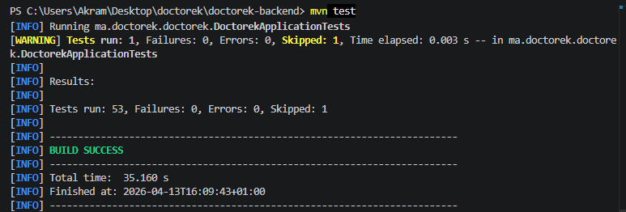
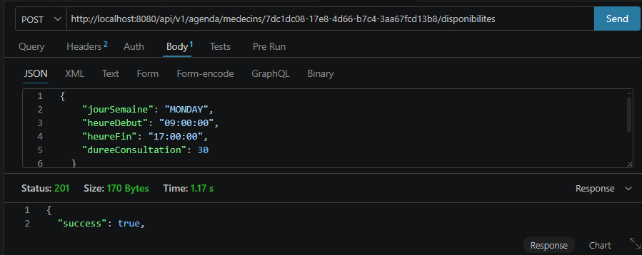
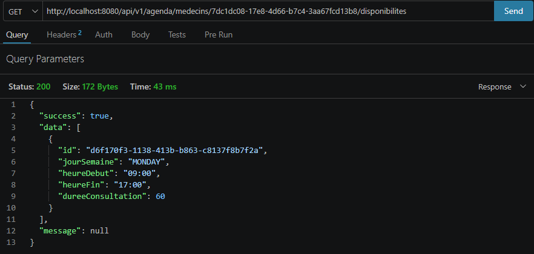
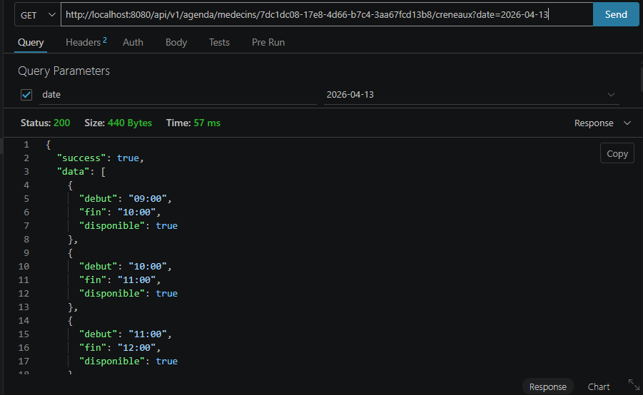

# US-11 — Agenda Médecin + Disponibilités

**Module** : `agenda`  
**Endpoints** : `POST/GET /api/v1/agenda/medecins/{id}/disponibilites` · `GET /api/v1/agenda/medecins/{id}/creneaux`  
**Stack** : Spring Boot 3.5.13 · Java 21 · PostgreSQL · JPA · Flyway  
**Tests** : 15 tests unitaires/slice (JUnit 5 + Mockito + MockMvc) — tous verts

---

## Table des matières

1. [Vue d'ensemble](#1-vue-densemble)
2. [Architecture en couches (DDD)](#2-architecture-en-couches-ddd)
3. [Design patterns utilisés](#3-design-patterns-utilisés)
4. [Modèle de données](#4-modèle-de-données)
5. [Contrat d'API](#5-contrat-dapi)
6. [Sécurité](#6-sécurité)
7. [Stratégie de test](#7-stratégie-de-test)
8. [Justifications techniques](#8-justifications-techniques)
9. [Preuves d'exécution](#9-preuves-dexécution)

---

## 1. Vue d'ensemble

L'US-11 introduit le module `agenda`, premier module du Sprint 3. Il permet à un médecin de définir ses plages de disponibilité hebdomadaires et expose aux patients les créneaux disponibles/pris pour une date donnée.

Trois endpoints :

| Endpoint | Rôle | Status |
|----------|------|--------|
| `POST /api/v1/agenda/medecins/{id}/disponibilites` | Upsert d'une disponibilité hebdomadaire | 201 |
| `GET /api/v1/agenda/medecins/{id}/disponibilites` | Liste toutes les disponibilités du médecin | 200 |
| `GET /api/v1/agenda/medecins/{id}/creneaux?date=YYYY-MM-DD` | Créneaux calculés pour une date donnée | 200 / 404 |

Le troisième endpoint croise les disponibilités hebdomadaires avec les rendez-vous déjà pris pour déterminer, en temps réel, quels créneaux sont encore libres.

---

## 2. Architecture en couches (DDD)

Un nouveau module `agenda` est créé en suivant les mêmes conventions DDD que les modules `auth` et `annuaire` :

```
agenda/
├── domain/                                   ← Couche Domaine
│   ├── Disponibilite.java                        record (id, medecinId, jourSemaine, heureDebut, heureFin, dureeConsultation)
│   ├── RendezVous.java                           record (id, medecinId, patientId, date, heure, duree, statut, motif, createdAt)
│   ├── Creneau.java                              record (debut, fin, disponible)
│   ├── StatutRdv.java                            enum { EN_ATTENTE, CONFIRME, ANNULE, TERMINE }
│   ├── DisponibiliteRepository.java              interface (findByMedecinId, findByMedecinIdAndJour, save, deleteByMedecinIdAndJour)
│   ├── RendezVousRepository.java                 interface (findByMedecinIdAndDate, save, existsByMedecinIdAndDateAndHeure)
│   ├── MedecinSansAgendaException.java           → 404
│   ├── DisponibiliteNotFoundException.java       → 404
│   ├── RendezVousNotFoundException.java          → 404
│   ├── CreneauIndisponibleException.java         → 409
│   └── RdvNonAnnulableException.java             → 422
│
├── application/                              ← Couche Application
│   ├── DefineDisponibiliteUseCase.java           validation + upsert (delete→save)
│   ├── GetDisponibilitesUseCase.java             lecture de toutes les disponibilités
│   ├── GetCreneauxDisponiblesUseCase.java        calcul des créneaux libres/pris
│   └── dto/
│       ├── DefineDisponibiliteRequest.java       @NotNull jourSemaine, heureDebut, heureFin, dureeConsultation
│       ├── DisponibiliteResponse.java            record + static from(Disponibilite)
│       └── CreneauResponse.java                 record + static from(Creneau)
│
├── infrastructure/                           ← Couche Infrastructure
│   ├── DisponibiliteEntity.java                  @Entity agenda.disponibilites (package-private)
│   ├── JpaDisponibiliteRepository.java           extends JpaRepository<DisponibiliteEntity, UUID>
│   ├── SpringDataDisponibiliteRepository.java    @Repository implements DisponibiliteRepository
│   ├── RendezVousEntity.java                     @Entity agenda.rendez_vous (package-private)
│   ├── JpaRendezVousRepository.java              extends JpaRepository<RendezVousEntity, UUID>
│   └── SpringDataRendezVousRepository.java       @Repository implements RendezVousRepository
│
└── web/                                      ← Couche Présentation
    └── AgendaController.java                     POST+GET disponibilites, GET creneaux

shared/web/
└── GlobalExceptionHandler.java               + 5 handlers agenda (404, 409, 422)
auth/infrastructure/
└── SecurityConfig.java                       + /api/v1/agenda/** → permitAll()
db/migration/
└── V5__create_agenda_schema.sql              schema agenda + 2 tables
```

### Flux — Définir une disponibilité

```
POST /api/v1/agenda/medecins/{medecinId}/disponibilites
    │
    ▼
AgendaController                    [web]
  @Valid @RequestBody DefineDisponibiliteRequest
    │
    ▼
DefineDisponibiliteUseCase          [application]
  validation : heureDebut < heureFin → sinon IllegalArgumentException
  repo.deleteByMedecinIdAndJour(medecinId, jourSemaine)   ← upsert step 1
  repo.save(new Disponibilite(null, medecinId, ...))       ← upsert step 2
    │
    ▼
SpringDataDisponibiliteRepository   [infrastructure]
  → PostgreSQL agenda.disponibilites
    │
    ▼
DisponibiliteResponse.from(saved)
    │
    ▼
ResponseEntity 201 Created { success: true, data: { id, medecinId, jourSemaine, heureDebut, heureFin, dureeConsultation } }
```

### Flux — Obtenir les créneaux disponibles

```
GET /api/v1/agenda/medecins/{medecinId}/creneaux?date=2026-04-14
    │
    ▼
AgendaController                    [web]
  @RequestParam @DateTimeFormat(iso=DATE) LocalDate date
    │
    ▼
GetCreneauxDisponiblesUseCase       [application]
  1. dispoRepo.findByMedecinIdAndJour(medecinId, date.getDayOfWeek())
     → Optional.empty() ? → MedecinSansAgendaException (404)
  2. rdvRepo.findByMedecinIdAndDate(medecinId, date)
  3. génère les créneaux par tranche de dureeConsultation minutes
  4. marque chaque créneau disponible = true/false (selon rdv existants)
    │
    ▼
ResponseEntity 200 OK { success: true, data: [{ debut, fin, disponible }, ...] }
```

---

## 3. Design patterns utilisés

### 3.1 Records Java comme types de valeur immutables

```java
public record Disponibilite(
    UUID       id,
    UUID       medecinId,
    DayOfWeek  jourSemaine,
    LocalTime  heureDebut,
    LocalTime  heureFin,
    int        dureeConsultation
) {}

public record Creneau(LocalTime debut, LocalTime fin, boolean disponible) {}
```

Tous les objets de domaine sont des `record` Java 21 : immuables par construction, sans setters, sans logique de persistance. Leur contenu exprime le modèle métier pur.

### 3.2 Pattern Upsert (delete + save)

```java
repo.deleteByMedecinIdAndJour(medecinId, request.jourSemaine());
Disponibilite toSave = new Disponibilite(null, medecinId,
    request.jourSemaine(), request.heureDebut(), request.heureFin(),
    request.dureeConsultation());
return repo.save(toSave);
```

Un médecin ne peut avoir qu'une seule disponibilité par jour de la semaine. Plutôt qu'un `merge` conditionnel, on supprime l'entrée existante puis on insère la nouvelle. Cette approche est explicite, sans logique conditionnelle et idempotente.

### 3.3 Entités JPA package-private

```java
// package-private — invisible hors du package infrastructure
@Entity
@Table(schema = "agenda", name = "disponibilites")
class DisponibiliteEntity {
    // ...
    Disponibilite toDomain() { ... }
    static DisponibiliteEntity fromDomain(Disponibilite d) { ... }
}
```

Les entités JPA sont package-private : elles ne peuvent pas être utilisées directement par la couche application ou web. Seul le `SpringDataXxxRepository` public expose les opérations CRUD via l'interface de domaine.

### 3.4 Calcul des créneaux en mémoire

```java
LocalTime cursor = dispo.heureDebut();
while (cursor.plusMinutes(dispo.dureeConsultation()).compareTo(dispo.heureFin()) <= 0) {
    LocalTime fin = cursor.plusMinutes(dispo.dureeConsultation());
    boolean pris = rdvSet.contains(cursor);
    creneaux.add(new Creneau(cursor, fin, !pris));
    cursor = fin;
}
```

Le calcul est fait en Java, pas en SQL. Les créneaux sont dérivés à la volée de la disponibilité et des rendez-vous : aucune table `creneaux` n'existe en base. Cela simplifie le schéma et garantit la cohérence.

### 3.5 Enveloppe `ApiResponse<T>`

Tous les endpoints retournent `ApiResponse.ok(data)` (succès) ou `ApiResponse.error(message)` (erreur), via `GlobalExceptionHandler` pour les cas d'erreur. La structure est uniforme sur toute l'API.

---

## 4. Modèle de données

### Migration Flyway V5

```sql
CREATE SCHEMA IF NOT EXISTS agenda;

CREATE TABLE agenda.disponibilites (
    id                   UUID PRIMARY KEY DEFAULT gen_random_uuid(),
    medecin_id           UUID        NOT NULL,
    jour_semaine         VARCHAR(10) NOT NULL,           -- ex. "MONDAY"
    heure_debut          TIME        NOT NULL,
    heure_fin            TIME        NOT NULL,
    duree_consultation   INT         NOT NULL,           -- en minutes
    UNIQUE (medecin_id, jour_semaine)
);

CREATE TABLE agenda.rendez_vous (
    id           UUID PRIMARY KEY DEFAULT gen_random_uuid(),
    medecin_id   UUID        NOT NULL,
    patient_id   UUID        NOT NULL,
    date_rdv     DATE        NOT NULL,
    heure_rdv    TIME        NOT NULL,
    duree        INT         NOT NULL,
    statut       VARCHAR(20) NOT NULL DEFAULT 'EN_ATTENTE',
    motif        TEXT,
    created_at   TIMESTAMP   NOT NULL DEFAULT now(),
    UNIQUE (medecin_id, date_rdv, heure_rdv)
);
```

### Contraintes clés

| Contrainte | Table | Effet |
|-----------|-------|-------|
| `UNIQUE (medecin_id, jour_semaine)` | `disponibilites` | Un seul créneau hebdomadaire par jour |
| `UNIQUE (medecin_id, date_rdv, heure_rdv)` | `rendez_vous` | Pas de double-réservation |
| `DEFAULT gen_random_uuid()` | Les deux | UUID généré en base |

### Stockage des enums

`DayOfWeek` et `StatutRdv` sont stockés sous forme de `VARCHAR` (ex. `"MONDAY"`, `"EN_ATTENTE"`) via `.name()` / `Enum.valueOf()`. Cela les rend lisibles directement en base sans décodage.

---

## 5. Contrat d'API

### 5.1 — Définir une disponibilité

```
POST /api/v1/agenda/medecins/{medecinId}/disponibilites
Content-Type: application/json
```

**Corps de la requête**
```json
{
  "jourSemaine":       "MONDAY",
  "heureDebut":        "09:00:00",
  "heureFin":          "17:00:00",
  "dureeConsultation": 30
}
```

| Champ | Type | Requis | Validation |
|-------|------|--------|-----------|
| `jourSemaine` | DayOfWeek (`MONDAY`…`SUNDAY`) | Oui | @NotNull |
| `heureDebut` | LocalTime (`HH:mm:ss`) | Oui | @NotNull |
| `heureFin` | LocalTime (`HH:mm:ss`) | Oui | @NotNull, doit être > heureDebut |
| `dureeConsultation` | int (minutes) | Oui | @Min(5) |

**201 Created**
```json
{
  "success": true,
  "data": {
    "id":                "a1b2c3d4-...",
    "medecinId":         "550e8400-...",
    "jourSemaine":       "MONDAY",
    "heureDebut":        "09:00",
    "heureFin":          "17:00",
    "dureeConsultation": 30
  },
  "message": null
}
```

**400 Bad Request** — champ manquant ou invalide
```json
{ "success": false, "data": null, "message": "jourSemaine must not be null" }
```

---

### 5.2 — Lister les disponibilités

```
GET /api/v1/agenda/medecins/{medecinId}/disponibilites
```

**200 OK**
```json
{
  "success": true,
  "data": [
    { "id": "...", "jourSemaine": "MONDAY", "heureDebut": "09:00", "heureFin": "17:00", "dureeConsultation": 30 },
    { "id": "...", "jourSemaine": "WEDNESDAY", "heureDebut": "08:00", "heureFin": "12:00", "dureeConsultation": 20 }
  ],
  "message": null
}
```

**200 OK — aucune disponibilité définie**
```json
{ "success": true, "data": [], "message": null }
```

---

### 5.3 — Créneaux disponibles pour une date

```
GET /api/v1/agenda/medecins/{medecinId}/creneaux?date=2026-04-14
```

| Paramètre | Type | Requis | Format |
|-----------|------|--------|--------|
| `date` | LocalDate (query) | Oui | `YYYY-MM-DD` |

**200 OK** — créneaux calculés
```json
{
  "success": true,
  "data": [
    { "debut": "09:00", "fin": "09:30", "disponible": true  },
    { "debut": "09:30", "fin": "10:00", "disponible": false },
    { "debut": "10:00", "fin": "10:30", "disponible": true  }
  ],
  "message": null
}
```

**404 Not Found** — le médecin n'a pas de disponibilité pour ce jour de la semaine
```json
{ "success": false, "data": null, "message": "Aucun agenda défini pour le médecin : id=550e8400-..." }
```

---

## 6. Sécurité

### Endpoints publics

```java
.requestMatchers("/api/v1/agenda/**").permitAll()
```

Les endpoints d'agenda sont publics : un patient non connecté peut consulter les créneaux disponibles d'un médecin. La prise de rendez-vous (US-12) nécessitera un JWT.

### Isolation inter-modules

Le module `agenda` ne dépend d'aucun module `auth` ou `annuaire`. Il reçoit les UUID (`medecinId`, `patientId`) en paramètre et les stocke comme référence opaque. La validation de l'existence du médecin sera renforcée en US-12.

### Contrainte d'unicité en base

La contrainte `UNIQUE (medecin_id, date_rdv, heure_rdv)` en base garantit qu'aucune double-réservation n'est possible, même sous charge concurrente — sans verrou applicatif.

---

## 7. Stratégie de test

### Organisation

```
src/test/java/ma/doctorek/doctorek/
├── agenda/
│   ├── application/
│   │   ├── DefineDisponibiliteUseCaseTest.java      (5 tests) ← nouveau
│   │   └── GetCreneauxDisponiblesUseCaseTest.java   (4 tests) ← nouveau
│   └── web/
│       └── AgendaControllerTest.java                (6 tests) ← nouveau
├── annuaire/
│   ├── application/ (7 tests)
│   └── web/ (4 tests)
├── auth/
│   ├── application/ (12 tests)
│   └── web/ (9 tests)
└── DoctorekApplicationTests.java                    (1 skipped)
```

**Total : 53 tests, 0 failures, 1 skipped**

### Tests unitaires — `DefineDisponibiliteUseCase` (5 tests)

| Test | Scénario |
|------|----------|
| `execute_heureDebutEqualsHeureFin_throws` | heureDebut == heureFin → `IllegalArgumentException` |
| `execute_heureDebutAfterHeureFin_throws` | heureDebut > heureFin → `IllegalArgumentException` |
| `execute_alwaysDeletesThenSaves` | Upsert : `deleteByMedecinIdAndJour` appelé avant `save` |
| `execute_validRequest_returnsSavedDispo` | Happy path : objet retourné avec tous les champs corrects |
| `execute_savesWithNullId` | `save` reçoit un `Disponibilite` avec `id == null` (UUID généré en base) |

### Tests unitaires — `GetCreneauxDisponiblesUseCase` (4 tests)

| Test | Scénario |
|------|----------|
| `execute_noDispo_throws` | Aucune disponibilité pour ce jour → `MedecinSansAgendaException` |
| `execute_noRdv_allCreneauxDisponible` | Aucun RDV → tous les créneaux `disponible: true` |
| `execute_rdvAt9h_firstCreneauNotDisponible` | RDV à 9h → premier créneau `disponible: false`, second `true` |
| `execute_allSlotsBooked_noneDisponible` | Tous les créneaux réservés → aucun `disponible: true` |

### Tests de slice web — `AgendaControllerTest` (6 tests)

```java
@WebMvcTest(AgendaController.class)
@Import({GlobalExceptionHandler.class, SecurityConfig.class})
```

| Test | Scénario | Status attendu |
|------|----------|---------------|
| `returns201WithDisponibilite` | POST valide → 201, body avec `id`, `jourSemaine`, `dureeConsultation` | 201 |
| `returns400WhenJourSemaineNull` | POST sans `jourSemaine` → 400, `success: false` | 400 |
| `returns200WithList` | GET disponibilites → 200, tableau avec `MONDAY` et `dureeConsultation` | 200 |
| `returns200WithEmptyList` | GET disponibilites → 200, `data: []` | 200 |
| `returns200WithCreneaux` | GET créneaux → 200, `debut: "09:00"`, `disponible: true/false` | 200 |
| `returns404WhenNoAgenda` | GET créneaux sans agenda → `MedecinSansAgendaException` → 404 | 404 |

---

## 8. Justifications techniques

### Pourquoi le calcul des créneaux est-il fait en mémoire et non en SQL ?

Générer les créneaux en SQL nécessiterait des fonctions de génération de séries temporelles (ex. `generate_series` de PostgreSQL), qui sont spécifiques à la base et difficiles à tester. Le calcul en Java est portable, testable unitairement (mock du repository), et la charge est négligeable pour une journée de travail (≤ 30 créneaux en pratique).

### Pourquoi l'upsert est-il `delete + insert` plutôt qu'un `merge` ?

Un `MERGE` SQL ou `findById + update` nécessite de distinguer les cas insertion/mise-à-jour, ce qui crée deux chemins de code. Le pattern `delete + save` est idempotent, simple, et produit toujours le même résultat quel que soit l'état initial.

### Pourquoi `DayOfWeek` est-il stocké en `VARCHAR` et non en `INT` ?

Stocker `"MONDAY"` au lieu de `1` rend la base auto-documentée et évite les ambiguïtés (ISO 8601 : lundi = 1, vs certains systèmes où dimanche = 1). La conversion `DayOfWeek.name()` / `DayOfWeek.valueOf()` est triviale.

### Pourquoi `agenda` est-il un schéma PostgreSQL séparé de `auth` ?

L'isolation par schéma matérialise la frontière entre modules en base, cohérente avec la séparation DDD en Java. Les tables `agenda.disponibilites` et `agenda.rendez_vous` ne sont jamais accessibles via les repositories du module `auth`, et vice-versa.

### Pourquoi la contrainte `UNIQUE (medecin_id, date_rdv, heure_rdv)` en base plutôt qu'en Java ?

Une vérification applicative (`existsBy...` + `save`) souffre d'une race condition sous charge : deux requêtes simultanées peuvent toutes deux passer le check et créer un doublon. La contrainte base est atomique et garantie sans verrou explicite.

---

## 9. Preuves d'exécution

### 9.1 — Suite de tests TDD (BUILD SUCCESS)

**Commande**
```bash
cd doctorek-backend
./mvnw test | grep -E "Tests run|BUILD"
```

**Résultat attendu** :
```
Tests run: 5   →  DefineDisponibiliteUseCase          (Failures: 0, Errors: 0)
Tests run: 4   →  GetCreneauxDisponiblesUseCase        (Failures: 0, Errors: 0)
Tests run: 6   →  AgendaController                    (Failures: 0, Errors: 0)
Tests run: 53, Failures: 0, Errors: 0, Skipped: 1
BUILD SUCCESS
```

> **Screenshot à prendre :** terminal avec la sortie `./mvnw test` ou IntelliJ → Run Tests → onglet "Test Results" montrant 53 tests verts.



---

### 9.2 — Définir une disponibilité (201 Created)

**Requête Postman**
```
POST http://localhost:8080/api/v1/agenda/medecins/{medecinId}/disponibilites
Content-Type: application/json

{
  "jourSemaine": "MONDAY",
  "heureDebut": "09:00:00",
  "heureFin": "17:00:00",
  "dureeConsultation": 30
}
```

**Observations à vérifier** :
- Status `201 Created`
- `success: true`
- `data.id` présent (UUID généré)
- `data.jourSemaine` = `"MONDAY"`

> **Screenshot à prendre :** Postman avec la requête POST et la réponse 201 visible.



---

### 9.3 — Upsert : remplacement d'une disponibilité existante

**Requête** : même URL, même `jourSemaine: "MONDAY"`, mais `heureDebut: "10:00:00"` et `heureFin: "18:00:00"`.

**Résultat attendu** : 201 avec les nouvelles heures, l'ancienne disponibilité du lundi remplacée.

> **Screenshot à prendre :** Postman — deux appels successifs sur le même `medecinId` + `MONDAY`. Le second retourne un `id` différent et les nouvelles heures.


---

### 9.4 — Lister les disponibilités (200 OK)

**Requête**
```
GET http://localhost:8080/api/v1/agenda/medecins/{medecinId}/disponibilites
```

**Observations** :
- Status `200 OK`
- `data` est un tableau
- Chaque entrée contient `jourSemaine`, `heureDebut`, `heureFin`, `dureeConsultation`

> **Screenshot à prendre :** Postman — GET avec la réponse 200 montrant la liste (au moins 1 disponibilité).



---

### 9.5 — Créneaux disponibles pour une date (200 OK)

**Requête**
```
GET http://localhost:8080/api/v1/agenda/medecins/{medecinId}/creneaux?date=2026-04-13
```

*(2026-04-13 est un lundi — la disponibilité MONDAY doit être trouvée)*

**Observations** :
- Status `200 OK`
- `data` est un tableau de créneaux
- Chaque créneau a `debut`, `fin`, `disponible`
- Les créneaux couvrent la plage `09:00 → 17:00` par tranches de 30 min

> **Screenshot à prendre :** Postman — GET creneaux avec au moins 3 créneaux visibles dans la réponse, montrant `disponible: true`.



---

### 9.6 — Créneau pris (disponible: false)

1. Créer un rendez-vous manuellement en base (ou via US-12 quand implémenté) à `2026-04-13 09:00`
2. Rappeler `GET /creneaux?date=2026-04-13`
3. Le créneau `09:00 → 09:30` doit afficher `"disponible": false`

> **Screenshot à prendre :** Postman — même GET creneaux après insertion d'un RDV, avec `disponible: false` visible sur le premier créneau.


---

### 9.7 — Aucun agenda pour ce jour (404 Not Found)

**Requête**
```
GET http://localhost:8080/api/v1/agenda/medecins/{medecinId}/creneaux?date=2026-04-14
```

*(2026-04-14 est un mardi — si aucune disponibilité TUESDAY n'est définie)*

**Réponse attendue** :
```json
{
  "success": false,
  "data":    null,
  "message": "Aucun agenda défini pour le médecin : id=..."
}
```

> **Screenshot à prendre :** Postman — GET creneaux pour un jour sans disponibilité définie, status 404 visible.


---

### 9.8 — Validation Bean (400 Bad Request)

**Requête**
```
POST http://localhost:8080/api/v1/agenda/medecins/{medecinId}/disponibilites
Content-Type: application/json

{
  "heureDebut": "09:00:00",
  "heureFin": "17:00:00",
  "dureeConsultation": 30
}
```
*(champ `jourSemaine` manquant)*

**Réponse attendue** :
```json
{
  "success": false,
  "data":    null,
  "message": "jourSemaine must not be null"
}
```

> **Screenshot à prendre :** Postman — POST sans `jourSemaine`, status 400 visible avec le message de validation.

